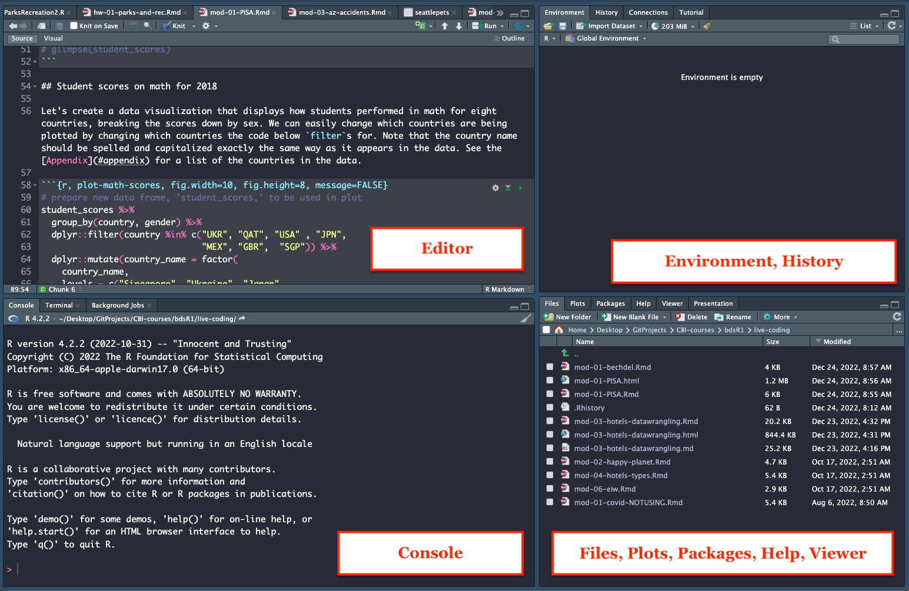
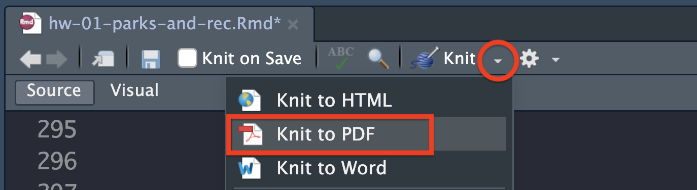
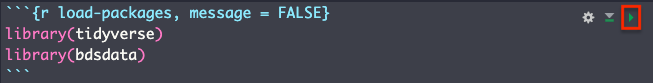

```{r include = FALSE}
source("assets/setup.R")
# Need to download "dsbox" for accessing original Edinburgh data Not on CRAN: devtools::install_github("rstudio-education/dsbox")
```

```{r include = FALSE, eval = TRUE}
# knitr::opts_chunk$set(
#   eval = FALSE,
#   out.width = "80%",
#   fig.asp = 0.618,
#   fig.width = 10
# )
library(tidyverse)
library(bdsdata)
```

```{r photo, fig.margin = TRUE, echo = FALSE, fig.width = 4, eval = TRUE}
knitr::include_graphics("img/parksandrec.jpeg")
```

The goal of this assignment is to introduce you to R, RStudio, and integration with Canvas, which you'll be using throughout the course both to learn the data science concepts discussed in the course and to analyze real data and come to informed conclusions.

# Getting started

## Prerequisites {data-link="Prerequisites"}

This assignment assumes that you have reviewed the lecture titled "Meet the toolkit: Programming." If you haven't yet done so, please pause and complete it before continuing.

## Terminology

We've already thrown around a couple of new terms, so let's define them before we proceed.

-   **R:** Name of the programming language we will be using throughout the course.

-   **RStudio:** An integrated development environment for R.
    In other words, a convenient interface for writing and running R code.

    -   In this course, assignment instructions you work on (HWs, Labs, Project) will be available on Canvas; however, the "starter" documents needed to complete each assignment will be available on RStudio Cloud.  

## Starting slow

As the course progresses, you are encouraged to explore beyond what the assignments dictate; a willingness to experiment will make you a much better programmer!
Before we get to that stage, however, you need to build some basic fluency in R.
First, we will explore the fundamental building blocks of R and RStudio.

Before you can get started with the analysis, you need to make sure you:

-   are a member of the course RStudio Cloud space; if you are not, then you did not complete the prerequisite for this assignment. Please go back to [Prerequisites] and complete it.

# Workflow

For each assignment in this course you will go to a shared folder in RStudio Cloud that contains starter documents you will build upon when working on your assignment. In RStudio you will edit them, run them,  view your results, and interpret them. In other words, all data analysis will happen in RStudio. 

Lets walk through some of the steps that will get you ready for analysis. 

# Hello RStudio!

Go to [rstudio.cloud](https://rstudio.cloud/ "RStudio Cloud") and then **navigate to the course workspace** via the left sidebar. It's very important that you do this for two reasons:

-   It's only when you're in the course workspace that you'll be able to benefit from R packages I've pre-installed for you so that your project can be configured correctly.
-   It's only when you're in the course workspace that your usage of RStudio Cloud won't count towards the free usage limits.

```{r course-workspace, echo = FALSE, eval = TRUE, fig.align = "center"}
knitr::include_graphics("img/course-workspace.png")
```

Before you proceed, confirm that you are in the course workspace by checking out what's on your top bar in RStudio Cloud.

## RStudio Layout

RStudio is comprised of four panes.

```{r rstudio-anatomy, fig.fullwidth=TRUE, echo = FALSE, eval = TRUE}

```

-   On the bottom left is the Console, this is where you can write code that will be evaluated. Try typing `2 + 2` here and hit enter, what do you get?
-   On the bottom right is the Files pane, as well as other panes that will come handy as we start our analysis.
-   If you click on a file, it will open in the editor, on the top left pane.
-   Finally, the top right pane shows your Environment. If you define a variable it would show up there. Try typing `x <- 2` in the Console and hit enter, what do you get in the **Environment** pane? 

# Warm up

Before we introduce the data, let's warm up with some simple exercises.

```{marginfigure}
The top portion of your R Markdown file (between the three dashed lines) is called **YAML**. It stands for "YAML Ain't Markup Language". It is a human friendly data serialization standard for all programming languages. All you need to know is that this area is called the YAML (we will refer to it as such) and that it contains meta information about your document.
```

## Step 1. Update the YAML

Open the R Markdown (Rmd) file in your project, change the author name to your name. And go ahead and put in today's date. 

```{r yaml-raw-to-rendered, echo = FALSE, eval = TRUE, fig.align = "center"}
knitr::include_graphics("img/yaml-raw-to-rendered-new.png")
```

## Step 2: Knit it!

Now, look for that little button at the top called "Knit" (in the image below, it's bounded in the red box). When you click it, you'll see some some activity under the **Render** tab in the Console pane and a beautiful notebook (similar to what you're reading now) will appear in the bottom-right Console pane under the **Viewer** tab.  

```{r knit-to-default, echo = FALSE, eval = TRUE, fig.align = "left"}
knitr::include_graphics("img/knit1.png")
```

## Step 3. Submit it to Canvas

When you're all done with the HW assignment and you're ready to submit the rendered document to Canvas, you want to change the "Knit" setting to **Knit to PDF.** To do this, select the dropdown arrow and you will see the option for knitting to PDF. Click it and look for the PDF document that has been generated in the same folder where you found the HW starter file. You will submit the PDF on Canvas.     

```{r knit-to-pdf, echo = FALSE, eval = TRUE, fig.align = "left"}

```

# Packages

R is an open-source language, and developers contribute functionality to R via packages.
In this assignment we will use the following packages:

-   **tidyverse**: a collection of packages for doing data analysis in a "tidy" way
-   **bdsdata**: a package (your instructors created) that contains various data sets for this course (Behavioral Data Science I)

We use the `library()` function to load packages.
In your R Markdown document you should see an R chunk labelled `load-packages` which has the necessary code for loading both packages.
You should also load these packages in your Console, which you can do by sending the code to your Console by clicking on the **Run Current Chunk** icon (green arrow pointing right icon).

```{r load-packages-chunk, echo = FALSE, eval = TRUE, fig.align = "left"}

```

Note that these packages also get loaded in your R Markdown environment when you **Knit** your R Markdown document.

# Data

The data we will be working with is all about the show ['Parks and Recreation,'](https://en.wikipedia.org/wiki/Parks_and_Recreation) a popular mockumentary style sitcom that ran from 2009-2015. The dataset contains some information about every episode from every season, and we will be focusing on which characters were mentioned in each episode's brief description on IMDB. We also have the average IMDB user rating for each episode, but that is for another day.

```{marginfigure}
[IMBD](https://www.imdb.com/) is a community-led online database for information related to films and television. One of the features is "User Ratings" that allows people to rate each episode on a scale from 1 to 10 (with 10 being the highest possible score). 
```

The data can be found in the **bdsdata** package, and it's called `parks_rec`.
Since the dataset is distributed with the package, we don't need to load it separately; it becomes available to us when we load the package.

```{marginfigure}
NOTE: 'parks_rec' is derived from a much more complete dataset that someone posted to the site [Kaggle.com](http://kaggle.com). Kaggle is a great online resource for aspiring and seasoned data scientists where lots of interesting datasets are provided by a large, open community. If curious, you can check out the original dataset [here](https://www.kaggle.com/datasets/bcruise/parks-and-recreation-episode-data). 
```

You can view the dataset as a spreadsheet using the `View()` function. Note that you should not put this function in your R Markdown document, but instead type it directly in the Console, as it pops open a new window (and the concept of popping open a window in a static document doesn't really make sense...).
When you run this in the console, you'll see the following **data viewer** window pop up.

```{r view-data}
View(parks_rec)
```

```{r data.viewer, echo = FALSE, eval = TRUE, fig.align = "left"}
knitr::include_graphics("img/view-data-new.png")
```

If you hover over description of each episode in the data viewer you can see the full description. 

You can find out more about the dataset by inspecting its documentation (which contains a **data dictionary**, name of each variable and its description), which you can access by running `?parks_rec` in the Console or using the Help menu in RStudio to search for `parks_rec`.

# Exercises

1.  According to the data dictionary, how many unique characters from the show are included in this dataset?

🧶 ✅ ⬆️ *Write your answer in your R Markdown starter document under Exercise 1, knit the document as a "html_document" (default output in the YAML).*

2.  Again, according to the data dictionary, how many rows of data do we have for this dataset?

🧶 ✅ ⬆️ *Write your answer in your R Markdown starter document under Exercise 2, knit the document as a "html_document" (default output in the YAML).*

3.  Who are the three most mentioned show characters across all seasons? To do this you will need to count the frequencies of each character and display the results in descending order of frequency so that you can easily see the top three most mentioned characters. The following code does exactly that.

```{marginfigure}
The two lines of code can be read as "Start with the parks_rec data frame, and then count the number of times each unique character shows up, and display the results sorted in descending order. The 'and then' in the previous sentence maps to %>%, the pipe operator, which takes what comes before it and plugs it in as the first argument of the function that comes after it."
```

```{r}
parks_rec %>%
  count(character, sort = TRUE)
```

🧶 ✅ ⬆️ *Write your answer in your R Markdown starter document under Exercise 3, knit the document as a "html_document" (default output in the YAML).*

Let's now look at the character "Leslie" played by Amy Poehler. We want to find out which season she shows up the most within each episode's description.  

For this we need to first `filter` the data to just get rows with "Leslie" as the character and count how many of these "Leslie" rows occur in each level of `season`. 

```{r leslie-mentions, eval=TRUE}
parks_rec %>%
  filter(character == "Leslie") %>%
  count(season, sort = TRUE)
```
In examining Leslie's mentions in each season, there looks like a big decline for some of the seasons compared to the rest. Is this really the case? In thinking critically, what else might be going on? Perhaps there are just fewer episodes in Seasons 1 and 7? Well, let's find out. 

To do this, let's start by grouping the data by season and then counting the number of rows in each season. R makes this really easy to do with the `group_by` function. 

```{r, eval=TRUE}
parks_rec %>%
  group_by(season) %>%
  count(sort = TRUE)
```
Oh. Oh. This doesn't look right. Were there really 100 episodes in Season 6?! Clearly each row does not correspond to a unique episode. So, what is going on? When we visually reinspect our data using `View(parks_rec)`, we might notice the following. Some of the rows have repeated episode numbers for each season because multiple characters can be mentioned for each episode.

```{r repeated.lines, echo = FALSE, eval = TRUE, fig.align = "left"}
knitr::include_graphics("img/repeated-lines.png")
```

4.  We want to run the same code we just used (with the `group_by` function), but after grouping by season, we want to get distinct episode numbers before counting. In other words, in the pipeline of the code, we want to add `distinct(episode_num)`. Go ahead and give it a try for the next exercise. When you run the code, you should get the following output:

```{r, eval = TRUE, echo=FALSE}
parks_rec %>%
  group_by(season) %>%
  distinct(episode_num) %>%
  count(sort = TRUE)
```
🧶 ✅ ⬆️ *Write your answer in your R Markdown starter document under Exercise 4, knit the document as a "html_document" (default output in the YAML).*

Now knowing there there are a different number of episodes for each season, looking at the raw count of how many times a character is mentioned across episodes does not really allow us to compare across seasons. For example, Leslie appears 6 times in Season 1, but 21 times in Season 5. But from our analysis, we know there are only 6 total episodes in Season 1, and she is featured in 100% of them (`6/6 = 1.0`). This is similar to the 95.45% (`21/22 = 0.95`) of episodes she is featured in for Season 5. 

```{marginfigure}
Clearly Leslie is the focus of the show! Most of the plots involve her in some featured way. 
```

The following visualization compares Leslie's mentions to some of the more mid-tier characters, taking proportion of overall episodes into account. 

```{r eval = TRUE, echo = FALSE, fig.fullwidth=TRUE}
df1 = parks_rec %>%
    distinct(season, episode_num) %>%
    group_by(season) %>%
    mutate(episode_num_season = max(episode_num)) %>%
  right_join(parks_rec, by = c("season", "episode_num"))

df2 = parks_rec %>%
  group_by(character) %>%
  count(season)

df3 = left_join(df1, df2, by = c("season", "character"))

final_props = df3 %>% 
  distinct(character, season, episode_num_season, n) %>%
  mutate(prop = n / episode_num_season) %>%
  arrange(season, desc(prop))
  
final_props %>% 
  filter(character %in% c("Leslie", "Andy", "April", "Ben")) %>%
  ggplot(aes(x = season, y = prop)) +
  geom_bar(stat="identity") + 
  scale_x_continuous(breaks=seq(1,7,1))+
  facet_wrap(~character) +
  theme_bw() + 
  labs(
    title = "Character Mentions Across Seasons",
    # subtitle = "Seasons 2, 3, 4, and 5",
    y = "Proportion of Episodes Character was Mentioned",
    x = "Season Number"
  )
```

5. Which character never is never featured more than 50% in any season? 
6. Which character is never mentioned in Seasons 1 and 2?

# Submit to Canvas

When you're all done, it's now time to do the final knit to submit this assignment on Canvas. Remember, you want to knit as a PDF and submit the generated PDF document for grading!


<!-- Now let's shift gears and take a look at the IMDB ratings. It might be interesting to see which episodes received the highest ratings. But first, lets get some simple summary statistics on the IMDB ratings so we know what we're working with. To do this we can run R's built-in `summary` function on our IMDB column. These functions are "generic" in that they get automatically loaded every time you open R.     -->

<!-- Notice the use of the `$`. This is used to select a particular column from a dataset, in this case, the `imdb_rating` column within the `parks_rec` dataset.  -->
<!-- ```{r} -->
<!-- summary(parks_rec$imdb_rating) -->
<!-- ``` -->

<!-- <!-- What is the max and minimum IMDB values for all episodes? --> 

<!-- Now lets see which episode from which season received the highest score.  -->

<!-- ```{r} -->
<!-- parks_rec %>% -->
<!--   arrange(imdb_rating) -->
<!-- ``` -->

<!-- But this output isn't exactly what we wanted. We want the IMDB ranked in "descending" order, or highest IMDB scores to lowest. To do this,  ... -->


