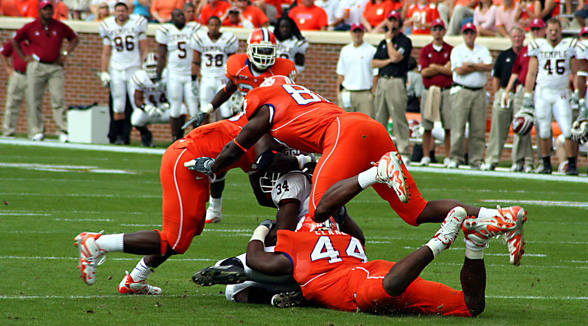

```{r include = FALSE}
knitr::opts_chunk$set(
  eval = FALSE,
  out.width = "80%",
  fig.asp = 0.618,
  fig.width = 10,
  dpi = 300
)
```

```{r photo, fig.margin = TRUE, echo = FALSE, fig.width = 3, fig.cap = "Photo from Wikimedia", eval = TRUE}

```

College football, a beloved and celebrated sport, captivates millions of fans nationwide while also providing a platform for young athletes to chase their dreams. However, beneath the glory of the gridiron lurk serious risks to the health and safety of student-athletes. College football players, often young and eager to showcase their talent, face a heightened risk of head injuries due to the game's physically demanding nature. The relentless collisions and intense practices contribute to a concerning pattern of concussions, putting the long-term health of these student-athletes in jeopardy. Research has shown that repeated concussions, even in the amateur ranks, can lead to severe conditions like chronic traumatic encephalopathy (CTE), prompting serious concerns about player safety.

These concerns have also sparked intense debates regarding the compensation of college athletes. Many argue that the current system, which classifies these players as "amateurs," is fundamentally flawed. The athletes who generate substantial revenue for their institutions and the NCAA often receive limited financial support or none at all, despite the physical and mental toll they endure. As the link between concussions and CTE becomes clearer, the call for fair compensation and improved healthcare for college football players grows louder. This intersection of player safety, amateurism, and financial exploitation in college sports underscores the need for a more equitable and comprehensive approach to the well-being of student-athletes.


# Getting started

Go to the course Posit Cloud Workspace and locate the Module 8 assignment project (or your own copy of it if you have already started it.)

First, open the R Markdown document `hw-08.Rmd` and Knit it.

## Warm up

Before we dive into the data, let's warm up with some simple exercises. Update the YAML of your R Markdown file with your information, knit, and examine the output.

## Packages

As always, we'll use the `tidyverse` package for much of the data wrangling and visualization and  the `modelr` package for some modeling functions. These packages are already installed for you. You can load them by running the following in your Console:

```{r load-packages, message = FALSE, eval = TRUE}
library(tidyverse)
library(modelr)
```

## Data

In this lab we will explore a subset of the data reported in the paper "Relationship of Collegiate Football Experience and Concussion With Hippocampal Volume and Cognitive Outcomes" (Singh et al., 2014) published in the *Journal of American Medical Association* (JAMA; [Paper Link](https://jamanetwork.com/journals/jama/fullarticle/1869211)). 

The data can be found in the `data` folder as `FootballBrain.csv`.

The full dataset includes data for 75 individuals with variables indicating their group (non-athlete, athlete with concussion history, and athletes without concussion history), measurements of their Hippocampal volume (whole and left-lobe) from MRI scans, years playing football, and their performance on a simple reaction time test meant to measure general cognitive ability.

```{r load-data, eval=TRUE, message = FALSE}
fb <- read_csv("data/FootballBrain.csv")
head(fb)
```

# Exercises

## Data wrangling

1. The original study included both collegiate athletes and non-athlete "controls". In our analyses we will focus only on collegiate athletes who completed the simple reaction time test. Filter the data to include only these individuals.

2. What kind of variable is the `Group` variable? Recode the `Group` variable into a factor where the "no concussion" group is the reference level.

🧶 👀 💾   *Now is a good time to save and knit your document and confirm the outputs look as you expect them to.*

## Exploratory data analysis

3. Let's investigate how concussion history affects Hippocampal volume and Cognition. We can be slick here and plot both variables at once with a faceted boxplot. You'll need to munge your data a bit by pivoting longer to support the faceting.
What would you conclude from this plot?

4. How does the number of years an athlete played football relate to their concussion history? Plot the number of years players played on the x-axis and the proportion of players who had a concussion history on the y axis. Use `geom_point()` to plot each value as a point, with the size of each point determined by the number of athletes it represents. What do you conclude from this plot?

5. Another way to plot this relationship would be with a boxplot with `Group` on the x-axis and `Years` on the y-axis. Briefly describe the advantages and disadvantages of these different approaches in terms of helping you understand the relationship.

6. Now let's explore the relationship between years playing football, Hippocampal volume, and simple response times. Create three scatterplots:  
1\. Years x hippocampal volume  
2\. Years x simple response times  
3\. Hippocampal volume x simple response times  
What can you conclude from these plots. Briefly describe your interpretation.

🧶 👀 💾   *Now is a good time to save and knit your document and confirm the outputs look as you expect them to.*

## Modeling

7.  Make a model called `fit1` predicting Hippocampal volume from number of years playing football. Print the summary of this model. How would you interpret the coefficient for `Years`? What is the $R^2$ of the model?

8. Now make two new models called `fit2` and `fit3`, where `fit2` predicts Hippocampal volume from number of years playing football and `Group`, and `fit3` adds an interaction term. Compare the coefficient for `Year` in `fit1` and `fit2` and describe what has changed.


This is known as "suppression" and it is due to *multi-collinearity* between the predictor variables. Whenever predictor variables are collinear (correlated), including them together in a model may affect the resulting coefficients as compared to modeling them separately. Look back at your data visualizations and identify the plot showing the relevant associations.

9. Compare the models using $R^2$ and using AIC. What do you conclude based on the rules of thumb discussed in lectures?


10. Create regression diagnostics plots for `fit2`. You may use the functions given to you in lab. Make three plots:  
1.\ Histogram of residuals  
2.\ Residual q-q plot  
3.\ Residuals x predicted  
What do you conclude about the appropriateness of this model?

11. Now make another model, `fit4` that predicts simple RT from Hippocampal volume. Display the summary. How much variance in simple RT does the model account for?

🧶 👀 💾   *Now is a good time to save and knit your document and confirm the outputs look as you expect them to.*

## Making causal inferences

These data are observational, not experimental. You have probably heard the mantra "correlation does not imply causation." But can we say something about causation in this case anyhow?

One plausible theory could be that the head trauma assciated with playing football causes brain changes including decrease in hippocampal volume, and these brain changes slow response times. This would be a causal chain: $\text{years} \rightarrow \text{hipp} \rightarrow \text{RT}$.

12. Reflect back on the plots you made in the previous section. Could there be another explanation for the correlations? Briefly describe another possible explanation.

13. Suppose I propose my own theory that years spent playing football causes both hippocampal changes and also directly causes cognitive changes reflected in simple RT by distracting players from intellectual pursuits that could sharpen their minds. This would be a common-cause structure:  $\text{hipp} \leftarrow \text{years} \rightarrow \text{RT}$ where years is a confounder between hippocampal volume and RT.  Perhaps you don't think this theory is very plausible, but can you use this correlational data to refute it?  
It will help to support this analysis if the coefficients of different variables can be interpreted on the same scale. First, make a new dataset called `fb_standardized` where you have standardized the `Hipp`, `Years`, and `RT` variables. A function for standardizing variables is shown in lecture 3 of this module, feel free to borrow it.

Recall the example of multicollinearity we saw before, where adding the `Group` variable changed the coefficient for `Years` in predicting Hippocampal volume. If we observe that adding a predictor $A$ to a model causes the coefficient of another predictor $B$ to drop to zero (or become negligible), then we can say that "controlling for" $A$ eliminates the association between $B$ and the response variable. If controlling for $A$ leaves an association between $B$ and the response, then we sometimes say $B$ predicts "over and above" the effect of $A$.  

If $A$ is the start of a causal chain, where $A \rightarrow B \rightarrow Y$, then we would expect controlling for $B$ to eliminate the association between $A$ and $Y$, but "controlling for" $A$ should have no effect on the coefficient for $B$. 

Conversely, if $A$ is a common-cause like $B \leftarrow A \rightarrow Y$, we would expect the coefficient for $B$ to become negligible if $A$ is included in the model and controlling for $B$ should have no effect on the coefficient for $A$.

14. Make three models and print their coefficients:  
1.\ `fit1_s` predicting RT from Hippocampal volume  
2.\ `fit2_s` predicting RT from years spent palying football   
3.\ `fit3_s` predicting RT from both Hippocampal volume and years spent playing football.  

15.   Describe how you could interpret the `Hipp` coefficient in `fit1_s` (remember, this is standardized).  
Then, compare all of the coefficients across the models. Is it more plausible that years spent playing football affects simple RT directly or that it does so mediated by changes in Hippocampal volume (or other related brain changes). Briefly describe what you would conclude. 


🧶 👀 💾   *Now is a good time to save and knit your document and confirm the outputs look as you expect them to.*

## Reflections

We have only dipped our toes into the possibilities and complexities of using statistical models to make causal inferences There is still a lot to learn and consider before you can make these kinds of inferences confidently and generally, but hopefully this has given you a taste for the process.

# Submitting your work

Once you are happy with the final state of your work, change the YAML `output` from `html_output` to `pdf_output.` Now knit the document to produce a final PDF file. Upload the PDF to the Canvas assignment.  