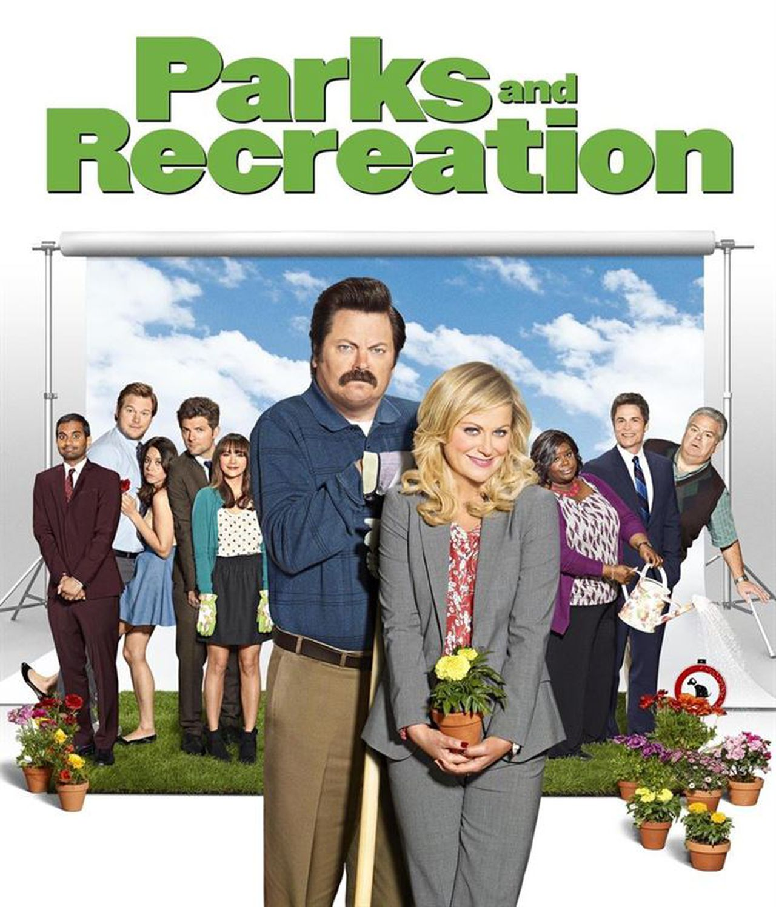

```{r include = FALSE}
source("assets/setup.R")
# Need to download "dsbox" for accessing original Edinburgh data not on CRAN: 
# devtools::install_github("rstudio-education/dsbox")
# devtools::install_github("asucbi/bdsdata")
```

```{r include = FALSE, eval = TRUE}
# knitr::opts_chunk$set(
#   eval = FALSE,
#   out.width = "80%",
#   fig.asp = 0.618,
#   fig.width = 10
# )
library(tidyverse)
library(bdsdata)
```

```{r photo, fig.margin = TRUE, echo = FALSE, fig.width = 4, eval = TRUE}

```

# Getting started

The goal of this assignment is to introduce you to R, RStudio, and its integration with Canvas. You'll be using all three throughout the course to analyze real data and come to informed conclusions!

## Starting slow

As the course progresses, you are encouraged to explore beyond what the assignments dictate; a willingness to experiment will make you a much better programmer!

Before we get to that stage, however, you need to build some basic fluency in R. First, we will explore the fundamental building blocks of R and RStudio.

## Terminology

We've already thrown around a few new terms, so let's define them before we proceed.

-   **R:** Name of the programming language we will be using throughout the course.

-   **RStudio:** An integrated development environment for R.
    In other words, a convenient interface for writing and running R code.

-   **Posit Cloud** The online service for accessing RStudio. 

## Hello RStudio!

Go to [rstudio.cloud](ADD URL HERE) and then **navigate to the course workspace** via the left sidebar. 

-   Look for the course workspace called "BDS in R | F25"

:::lo 
If anyone in your team is getting stuck, **go find the Canvas page "How to set up and access Posit Cloud" and follow the instructions there.**  
:::

## Access Projects

For each assignment within each module there will be what is called an "RStudio Project." 

If you look now, there should be a project available to you called: **Assignments: Module 1.** Go ahead and open it. 

## RStudio Layout

You are now in Posit Cloud/RStudio. It is here where you will edit documents, run code, view your results, and interpret them. Basically, everything you need to do data science is contained here. Now, time to get familiar with the layout. 

<p style="margin-bottom: 20px;">
RStudio is comprised of **four panes:**
</p>

```{r rstudio-anatomy, fig.fullwidth=TRUE, echo = FALSE, eval = TRUE}
knitr::include_graphics("img/rstudio-anatomy-new.png")
```

<p style="margin-top: 20px;">
-   On the **bottom left** is the **Console,** this is where you can write code that will be evaluated. 
</p> 

:::lo
Try typing `2 + 2` here and hit enter, what do you get?
:::

- On the **bottom right** is the **Files** pane, as well as other panes that will come handy as we start our analysis.
  - If you click on a file, it will open in the editor, on the top left pane.
- The **top right** pane shows your **Environment.** If you define a variable it would show up there. 

:::lo
Go ahead and define your first variable. Try typing `x <- 2` in the Console and hit enter, what do you get in the **Environment** pane? 
:::

- Finally, the **top left** pane is the Editor where you will primarily be writing code and text into a special document called a R Notebook.  

:::yellow
**NOTE:** An R Notebook is a type of document that combines R code with ordinary text and graphics, allowing you to write, run, and see the results of your R code alongside commentary and analysis. It's a powerful tool for data analysis and visualization, making it easy to compile your findings, code, and charts in one interactive and easy-to-share document.
:::

## Starter Files

In the Files pane you should see these two R Notebooks:

- mod-01-lab.Rmd
- mod-01-hw.Rmd

Go ahead and open up `mod-01-lab.Rmd`. This is your "starter file" for this assignment. You will build upon this document as you work on the exercises in this assignment. When you are done, you will generate a PDF from this document and submit it on Canvas. More on that later. 

# Warm up

Before we introduce the data, let's warm up with some simple exercises.

## Step 1. Update the YAML

:::lo
<p style="margin-bottom: 20px;">
Assuming `mod-01-lab.Rmd` is open, change the author name to your name at the very top. And go ahead and put in today's date. You've just edited the metadata for this Notebook. 
</p>

```{r yaml-raw-to-rendered, echo = FALSE, eval = TRUE, fig.align = "center"}
knitr::include_graphics("img/yaml-raw-to-rendered-new.png")
```
:::

:::yellow
**NOTE:** The top portion of your R Markdown document (between the three dashed lines) is called **YAML**. It stands for "YAML Ain't Markup Language". It contains metadata (settings and information about the notebook itself). It's used to specify things like the title, author, date, and output format (e.g., PDF, HTML). Think of it as a header that tells R and other tools how to process and display the notebook, ensuring that the document is formatted and behaves as intended when it's compiled or shared.
:::

## Step 2: Knit it!

:::lo
<p style="margin-bottom: 20px;">
Now, look for that little button at the top called "Knit" (in the image below, it's bounded in the red box). Go ahead and click it now. You'll see some some activity under the **Render** tab in the Console pane and a beautiful notebook (similar to what you're reading now) will appear in the bottom-right Console pane under the **Viewer** tab. 
</p>

```{r knit-to-default, echo = FALSE, eval = TRUE, fig.align = "left"}
knitr::include_graphics("img/knit1.png")
```
:::

:::green
**NOTE:** When you knit for the first time, your browser might get upset if you have an ad blocker on. Watch my video "How to prepare and submit a submission in Posit Cloud for Canvas" in the Module "Important Resources and HOWTOs" if you're having trouble. 
:::

## Step 3. Submit it to Canvas

When you're all done with the HW assignment and you're ready to submit the rendered document to Canvas, you want to change the "Knit" setting to **Knit to PDF.** 

:::lo
Go ahead and do this now. Select the dropdown arrow and you will see the option for knitting to PDF. Click it and look for the PDF document that has been generated in the same folder where you placed the HW starter file. You will submit the PDF on Canvas.     

```{r knit-to-pdf, echo = FALSE, eval = TRUE, fig.align = "left"}
knitr::include_graphics("img/knit2.png")
```
:::

# Packages

R is an open-source language, and developers contribute functionality to R via packages.
In this assignment we will use the following packages:

-   **tidyverse**: a collection of packages for doing data analysis in a "tidy" way
-   **bdsdata**: a package (your instructors created) that contains various data sets for this course (Behavioral Data Science I)

:::yellow
**NOTE:** R packages are add-ons for the R programming language, providing extra functions and tools for tasks like data analysis and visualization. They're like apps you install to expand R's abilities, with thousands available on CRAN (Comprehensive R Archive Network) for various uses, from plotting charts to statistical testing, simplifying complex operations."
:::

<p style="margin-bottom: 20px;">
We use the `library()` function to load packages.

In your R Markdown document you should see an R chunk labelled `load-packages` which has the necessary code for loading both packages.

:::lo
Go ahead and load these into your Console by clicking on the **Run Current Chunk** icon (green arrow pointing right icon).

```{r load-packages-chunk, echo = FALSE, eval = TRUE, fig.align = "left"}
knitr::include_graphics("img/load-packages-chunk-new.png")
```
:::

Note that these packages also get loaded in your R Markdown environment when you **Knit** your R Markdown document.

# Data

The data we will be working with is all about the show ['Parks and Recreation,'](https://en.wikipedia.org/wiki/Parks_and_Recreation) a popular mockumentary style sitcom that ran from 2009-2015. 

The dataset contains IMDB information about every episode from every season. **We will be focusing on which characters were mentioned in each episode's description.** I know, I know, not super exciting, but it's just to get us started. 

:::yellow
**NOTE:** [IMBD](https://www.imdb.com/) is a community-led online database for information related to films and television. One of the features is "User Ratings" that allows people to rate each episode on a scale from 1 to 10 (with 10 being the highest possible score). 
:::

The data can be found in the **bdsdata** package, and it's called `parks_rec`.
Since the dataset is distributed with the package, we don't need to load it separately; it becomes available to us when we load the package.

:::yellow
**NOTE:** `parks_rec` is derived from a much more complete dataset that someone posted to the site [Kaggle.com](http://kaggle.com). Kaggle is a great online resource for aspiring and seasoned data scientists where lots of interesting datasets are provided by a large, open community. If curious, you can check out the original dataset [here](https://www.kaggle.com/datasets/bcruise/parks-and-recreation-episode-data). 
:::

:::lo
You can view the dataset as a spreadsheet using the `View()` function. Type it directly into the Console and press Enter. 

```{r view-data}
View(parks_rec)
```

You'll see the following **data viewer** window pop up.

```{r data.viewer, echo = FALSE, eval = TRUE, fig.align = "left"}
knitr::include_graphics("img/view-data-new.png")
```
:::

:::lo
What happens when you type the `View()` function into your R Markdown file and try to knit it? Go ahead. Do it! 
:::

Next, if you hover over description of each episode in the data viewer you can see the full description. 

Next, you can find out more about the dataset by inspecting its documentation. 

How do you pull up this so-called documentation? 

With the power of `?`. In the R programming language, typing `?` followed by a function or dataset name is a quick and efficient way to access help documentation. 

:::lo
Go ahead and type `?parks_rec` in the Console and see what happens. 
:::

::::yellow
**NOTE:** 

This `?` feature is crucial for both beginners and experienced users because it provides immediate explanations, usage examples, and details about the function or dataset's parameters and behavior. Essentially, it acts as an instant guide, making it easier to understand and correctly apply various tools and data within R.
:::

---

Ok, now it's time to start answering exercise questions in your R markdown starter file. 

# Exercises

1.  According to the data dictionary, how many unique characters from the show are included in this dataset?

🧶 ✅ *Write your answer in your R Markdown starter document under Exercise 1, knit the document as a "html_document" (default output in the YAML).*

---

2.  Again, according to the data dictionary, how many rows of data do we have for this dataset?

🧶 ✅ *Write your answer in your R Markdown starter document under Exercise 2, knit the document as a "html_document" (default output in the YAML).*

---

3.  Who are the three most mentioned show characters across all seasons? To do this you will need to count the frequencies of each character and display the results in descending order of frequency. The following code does exactly that. Go ahead and write it for yourself. 

```{r}
parks_rec %>%
  count(character, sort = TRUE)

```

:::green
If you were going to read the two lines of code above in plain English, it would go something like: "Start with the `parks_rec` data frame, **and then** count the number of times each unique character shows up, and display the results sorted in descending order." 

Really pay attention to that weird set of symbols, `%>%` (also called a "pipe operator"). It is the same as saying **and then.** Like any good conjunction, it connects things. In this case, it is connecting the data frame with the `count` function.  
:::

🧶 ✅ *Write your answer in your R Markdown starter document under Exercise 3, knit the document as a "html_document" (default output in the YAML).*

---

**Moving on to Exercise 4** 

Now I'm going to give you a set of instruction you need to plug into your document. These will help you answer Exercise 4 (which is coming up next).  

We're going to zoom in on the character "Leslie" played by Amy Poehler. We want to find out which season she shows up the most. 

For this we need to first `filter` the data to just get rows with "Leslie" as the character and count how many of these "Leslie" rows occur in each level of `season`. 

```{r leslie-mentions, eval=TRUE}
parks_rec %>%
  filter(character == "Leslie") %>%
  count(season, sort = TRUE)
```

:::lo
**STOP HERE** and as a group make sure you understand what is going on. **DISCUSS!** 

What does the `%>%` represent in this code? What do the numbers under the `n` column represent? 
:::

One thing you and your team may have noticed is that there looks like a big decline of episodes mentioning "Leslie" in certain seasons. Is this really the case? In thinking critically, what else might be going on? 

**Perhaps there are just fewer episodes in Seasons 1 and 7 compared to the other seasons?** 

Well, let's find out. Let's count how many unique episodes are in each season.

To do this we start start by grouping the data by season and then counting the number of rows in each season. 

And voila! I just wrote the code to do it below. Go ahead and copy it and run it for yourself. 

```{r, eval=TRUE}
parks_rec %>%
  group_by(season) %>%
  count(sort = TRUE)
```

:::lo
**STOP HERE** and as a group make sure you understand what is going on. **DISCUSS!** 

First: what do you think the `group_by` function in the code is doing? State it in plain English. 

Second: The table (i.e., tibble) that the code generated doesn't look right. What doesn't look right? Why might there be a problem in the numbers being generated? 

After you've discussed it a bit, go ahead and **click the little word "Solution"** below for my answer.

`r solbegin(show=params$SHOW_SOLS, toggle=params$TOGGLE)`
Were there really 100 episodes in Season 6?! Likely not. In our code we are assuming that each row corresponds to a unique episode. But is this right?  

When we visually reinspect our data using `View(parks_rec)`, we might notice the following. The `episode_num` column has repeating values. Clearly each row does not correspond to a unique episode. 

```{r repeated.lines, echo = FALSE, eval = TRUE, fig.align = "left"}
knitr::include_graphics("img/repeated-lines.png")
```
`r solend()`
:::

**Let's fix things**

We want to run the same code we just used, but after grouping by season, we want to get distinct episode numbers before counting. That is, we want to add the `distinct()` function somewhere to the following code:

```{r leslie-mentions-2, eval=FALSE, echo=TRUE}
parks_rec %>%
  group_by(season) %>%
  count(sort = TRUE)
```

4. Update the code chunk by adding the `distinct()` function with the correct argument. 

__Let me give you some hints on how to do this:__

  -   What is the `distinct` function? Why not use `?` to pull up its documentation to see if you can decipher any clues on how to use it. 
  -   The `distinct` function takes an argument. Just like the `group_by` function takes an argument (in our code, it's the `season` column). What column in our data frame do we want distinct values for? 
  -   When you add a new function, a lot of times you need to do add it as a new pipeline. So you'll need to use `%>%` as well, right?

If you do things correctly, you will get a table that looks like the following:

```{r, eval = TRUE, echo=FALSE}
parks_rec %>%
  group_by(season) %>%
  distinct(episode_num) %>%
  count(sort = TRUE)
```


🧶 ✅ *Write your answer in your R Markdown starter document under Exercise 4, knit the document as a "html_document" (default output in the YAML).*

---

:::green
**NOTE:** What we just did above was meant to underscore a very important point. When you write code and get some output, that's only the first step. It is up to you to determine whether the output makes sense! If not, adjust accordingly.  
:::

**Moving on to Exercise 5** 

Now that we just discovered that there are indeed a different number of episodes for each season, looking at the raw count of how many times a character is mentioned across episodes does not allow for a fair comparison. For example, Leslie appears 6 times in Season 1, but 21 times in Season 5. We can confirm this from our earlier analysis. But we also know from our other analysis there are only 6 episodes in Season 1. This means, for Season 1, Leslie is featured in 100% of them (`6/6 = 1.0`). This is similar to the 95.45% (`21/22 = 0.95`) of episodes she is featured in for Season 5. 

:::lo
**STOP HERE** and as a group make sure you understand why using raw counts does not allow for a fair comparison. **DISCUSS!** 
:::

What might make for a fairer comparison? Rather than raw count, **lets do proportions.** 

The following visualization compares Leslie's mentions to some of the more mid-tier characters, **taking proportion of overall episodes into account.** 

```{r eval = TRUE, echo = FALSE, fig.fullwidth=TRUE}
df1 = parks_rec %>%
    distinct(season, episode_num) %>%
    group_by(season) %>%
    mutate(episode_num_season = max(episode_num)) %>%
  right_join(parks_rec, by = c("season", "episode_num"))

df2 = parks_rec %>%
  group_by(character) %>%
  count(season)

df3 = left_join(df1, df2, by = c("season", "character"))

final_props = df3 %>% 
  distinct(character, season, episode_num_season, n) %>%
  mutate(prop = n / episode_num_season) %>%
  arrange(season, desc(prop))
  
final_props %>% 
  filter(character %in% c("Leslie", "Andy", "April", "Ben")) %>%
  ggplot(aes(x = season, y = prop)) +
  geom_bar(stat="identity") + 
  scale_x_continuous(breaks=seq(1,7,1))+
  facet_wrap(~character) +
  theme_bw() + 
  labs(
    title = "Character Mentions Across Seasons",
    # subtitle = "Seasons 2, 3, 4, and 5",
    y = "Proportion of Episodes Character was Mentioned",
    x = "Season Number"
  )
```

:::green
Clearly Leslie is the focus of the show! Most of the plots involve her in some featured way. 
:::

5. Using information from the visual, which character is never featured in more than 50% of any season? 

---

6. Using information from the visual, which character is never mentioned in Seasons 1 and 2?

# Submit to Canvas

When you're all done, it's now time to do the final knit to submit this assignment on Canvas. Remember, you want to knit as a PDF and submit the generated PDF document for grading! If you cannot remember how, or are running into problems, please watch my little video in the Canvas page: "How to prepare and submit a submission in Posit Cloud for Canvas"


