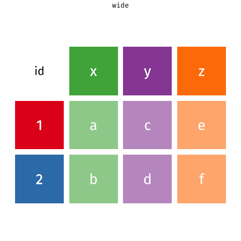

```{r setup, include=FALSE}
source('assets/setup.R')

# :::red : use for pre-lab activity instructions
# :::lo : use for outlining the learning objectives

# :::green : use for tips/hints on how to complete the task
# :::yellow : use for additional information on how to use R that does not directly have anything to do with the assignment tasks

# :::frame : use when want to set some additional instructions/code/examples apart from the assignment task when explaining something about how to use R
# :::blue : same color as question box background. Not sure how much this needs to be used. 
# :::statbox : looks a lot like yellow

```

Below are two data visualizations that violate many data visualization best practices.

Improve these visualizations using R and the tips for effective visualizations that we introduced in class (and in the lecture).

__You should produce one visualization per dataset.__

Your visualization should be accompanied by a brief paragraph describing the choices you made in your improvement, specifically discussing what you didn't like in the original plots and why, and how you addressed them in the visualization you created.

:::lo
**LEARNING OBJECTIVES**

-   Telling a story with data
-   Data visualization best practices
-   Practice with importing and reshaping data
:::

# Getting started

Go to the Posit Cloud and locate the project folder for "Module 5" and open the starter R Markdown document.

Knit the document to make sure it compiles without errors.

## Warm up

Before we introduce the data, let's warm up with some simple exercises.

Update the YAML of your R Markdown file with your information and knit.

## Packages

Per usual, we'll use the **tidyverse** package for much of the data wrangling, and also the **readxl** package which will be obvious when you go to work with the second dataset. 

You can load it by running the following in your Console:

```{r eval = TRUE, message = FALSE}
library(tidyverse) 
library(readxl)
```

## Data

The datasets we'll use are called `instructional-staff.csv` and `fisheries.xlsx` in the `data` folder.

# Exercises

## Instructional staff employment trends

The American Association of University Professors (AAUP) is a nonprofit membership association of faculty and other academic professionals.

[This report](https://www.aaup.org/sites/default/files/files/AAUP_Report_InstrStaff-75-11_apr2013.pdf) compiled by the AAUP shows trends in instructional staff employees between 1975 and 2011, and contains an image very similar to the one given below. It's pretty rough. 

```{r echo=FALSE, fig.fullwidth = TRUE}
knitr::include_graphics("img/staff-employment.png")
```

To start your journey in improving visualization story-telling, let's start by loading the data used to create this plot. Instead of doing it for you, go ahead and do it for yourself. Make sure to call the imported data `staff`. 

```{r load-data-staff, eval = FALSE}
# What is the function you should be using to load in this data type? 
# Where should you be looking for the data file?
staff <- ___ 
```

```{r message = FALSE, echo= FALSE, eval = TRUE}
staff <- read_csv("data/instructional-staff.csv")
```

Once imported, you will see that each row in this dataset represents a faculty type, and the columns are the years for which we have data.

The values are percentage of hires of that type of faculty for each year.

```{r echo = FALSE}
staff
```

In order to create a better visualization, we really need to reshape the dataset to so we have one variable for faculty type and one variable for year.

In other words, we will convert the data from wide format to long format.

But before we do so, a thought exercise: *How many rows will the long-format data have?* It will have a row for each combination of year and faculty type.

If there are 5 faculty types and 11 years of data, how many rows will we have?

We do the wide to long conversion using a function you should already be familiar to you: `pivot_longer()`.

Just as a reminder, the animation below shows how this function works, as well as its counterpart `pivot_wider()`.

```{r echo = FALSE}

```

---

`r qbegin(1)`

Now go ahead and convert the data from wide to long. For your `names_to =` argument, name it "year." Call the new dataframe "staff_long."

`r qend()`

:::yellow
__HINT__ For selecting columns to pivot, you could write out the years into a character vector, but can you think of a simpler way? Nevertheless, whatever answer you come up with that generates the same output I have in the "Solution" dropdown will be considered correct.  
:::

:::green
__WANT A SNEAK PEEK AT THE SOLUTION?__ If you want to see the final output, go ahead and click "Solution" below to open up a dropdown display. You can do this anytime where you see "Solution" in these instructions. 
:::

`r solbegin(show=params$SHOW_SOLS, toggle=params$TOGGLE)`
```{r echo=FALSE}
staff_long <- staff %>%
  pivot_longer(cols = -faculty_type, names_to = "year") %>%
  mutate(year = as.numeric(year))
```

```{r}
staff_long
```
`r solend()`

```{r echo=FALSE, eval = FALSE}
# The function has the following arguments:
# 
# pivot_longer(data, cols, names_to = "name")
# 
# -   The first argument is `data` as usual.
# -   The second argument, `cols`, is where you specify which columns to pivot into longer format -- in this case all columns except for the `faculty_type`
# -   The third argument, `names_to`, is a string specifying the name of the column to create from the data stored in the column names of data -- in this case `year`
```

---

`r qbegin(2)`

Now that you have the data in a long format, create a simple line plot using `ggplot` where you color the lines by `faculty_line`.

`r qend()`

:::green
__HOLD ON! YOU SURE YOU WANT A SNEAK PEEK?__ I challenge you to first attempt creating the plot before looking at the expected output.  
:::

`r solbegin(show=params$SHOW_SOLS, toggle=params$TOGGLE)`
```{r echo=FALSE, fig.width = 10, fig.fullwidth = TRUE}
staff_long %>%
  ggplot(aes(x = year, y = value, color = faculty_type)) +
  geom_line()
```
`r solend()`

```{r echo=FALSE, eval = FALSE}
# But note that this results in a message as well as an unexpected plot.
# The message is saying that there is only one observation for each faculty type year combination.
# We can fix this using the `group` aesthetic following.
# 
# staff_long %>%
#   ggplot(aes(x = year, y = value, group = faculty_type, color = faculty_type)) +
#   geom_line()
```

---

`r qbegin(3)`

Make sure the figure width is large enough to make it legible.

Fix the title, axis labels, and legend label.

`r qend()`

---

:::yellow
__Remember__ not every solution you might employ is going to be something we explicitly covered in class. While there are lots of things we will have covered, you might need to do some Google searching with different keywords to figure out the right bit of code to do what you want to do. That is totally ok.    
:::

`r qbegin(4)`

Suppose the objective of this plot was to show that the percentage of part-time faculty have gone up over time compared to other instructional staff types. 

The plot should already be telling you this, but what changes could you make to this plot to really make the story obvious?

__Do not actually create a figure (that's the next question).__ This is brainstorming time! Think about (and write out) how the figure could look to tell the targeted story. 

Write up the change(s)/decision(s) you made as bullet points (i.e., as a list).

`r qend()`

:::yellow
To format with bullet points (lists) in R Markdown and you don't remember how, within R Studio you can go to the option at the very top of the screen `Help > Markdown Quick Reference`. Or you can just do a quick Google search.
:::

---

`r qbegin(5)`

Implement the changes you proposed in the previous exercise. That is, create an improved figure! Your new figure should be different from what we started with, and there is no one right answer.  

Your visualization should be accompanied by a brief paragraph describing the following:

- What were options you considered in your improvement?
- What did you not like in the original plot and why?
- How did you specifically address the things you didn't like in your new visualization?

`r qend()`

---

## Fisheries

Fisheries and Aquaculture Department of the Food and Agriculture Organization of the United Nations collects data on fisheries production of countries.

[This Wikipedia page](https://en.wikipedia.org/wiki/Fishing_industry_by_country) lists fishery production of countries for 2016.

For each country, tonnage from capture (Variable 1) and aquaculture (Variable 2) are listed.

__Note that there are a lot of countries whose total harvest was relatively small so they are not included in the visualization. You might want to do something similar.__

A researcher shared with you the following visualization they created based on these data. Yikes!
😳

```{r echo=FALSE, fig.fullwidth = TRUE}
knitr::include_graphics("img/fisheries.png")
```

`r qbegin(6)`

Can you help them make improve it? 

First, brainstorm how you would improve it. 

Write up the changes/decisions you made as bullet points. It's ok if some of your improvements are aspirational, i.e. you don't know how to implement it, but you think it's a good idea. 

In your write-up, consider the following:

- What were options you considered in your improvement?
- What did you not like in the original plot and why?
- How did you specifically address the things you didn't like in your new visualization?

`r qend()`

---

```{r message = FALSE, echo= FALSE, eval = TRUE}
fisheries <- read_excel("data/fisheries.xlsx")
```

`r qbegin(7)`

Create a new data visualization for these data that implements the improvements you proposed in the previous exercise (or many of them as you can). And remember: there is no one right answer. 

`r qend()`

:::green
Although this might be obvious at this point, you need to import the data associated with fisheries to start working with it. You are a pro by now. But note that you're no longer working with a ".csv" file. 
:::

# Wrapping up

Now knit the final document as a PDF and make sure that everything is looks ok. 

Also, make sure you are following coding style guidelines we discussed in class. Make any edits as needed.

Also, __make sure all of your R chunks are properly labelled, and your figures are reasonably sized.__

# More ugly charts

Want to see more ugly charts?

-   [Flowing Data - Ugly Charts](https://flowingdata.com/category/visualization/ugly-visualization/)
-   [Reddit - Data is ugly](https://www.reddit.com/r/dataisugly/)
-   [Missed Opportunities and Graphical Failures](http://www.datavis.ca/gallery/missed.php)
-   [(Mostly Bad) Graphics and Tables](http://users.stat.umn.edu/~rend0020/Teaching/STAT8801-resources/graphics/index.html)
