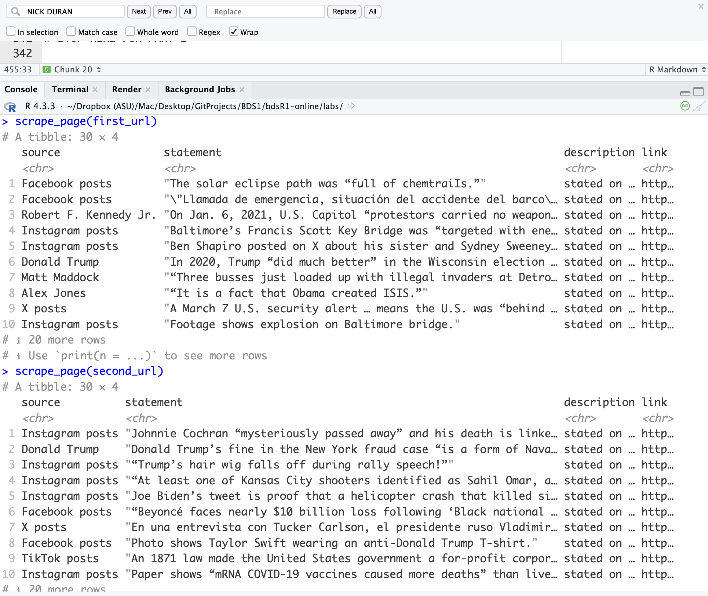

```{r setup, include=FALSE}
source('assets/setup.R')
knitr::opts_chunk$set(eval = TRUE)
library(robotstxt)
library(rvest)
library(tidyverse)

# :::red : use for pre-lab activity instructions
# :::lo : use for outlining the learning objectives

# :::green : use for tips/hints on how to complete the task
# :::yellow : use for additional information on how to use R that does not directly have anything to do with the assignment tasks

# :::frame : use when want to set some additional instructions/code/examples apart from the assignment task when explaining something about how to use R
# :::blue : same color as question box background. Not sure how much this needs to be used. 
# :::statbox : looks a lot like yellow

```

*"Fake news has become an important topic of research in a variety of disciplines including psychology, linguistics, and computer science. A critical goal in this line of work is in building systems to automatically detect misinformation in news. However, a major challenge is in collecting quality data, i.e., instances of fake and real news articles on a balanced distribution of topics."* [See this article for a compelling argument](https://journals.sagepub.com/doi/10.1177/2053951719843310).

In this lab we're going to scrape data from [PolitiFact's fact-checking website](https://www.politifact.com/article/2018/feb/12/principles-truth-o-meter-politifacts-methodology-i/), following a similar strategy used in the paper "Big Data and quality data for fake news and misinformation detection." 

PolitiFact has a regular feature called the "Truth-O-Meter." They focus on specific statements made by politicians, selecting the most newsworthy and significant ones, and rate them for accuracy. To do so they use on-the-record interviews and publish a list of sources with every fact-check. Statements can be rated on one of six levels of accuracy. We are going to focus on statements that PolitiFact has deemed "PANTS ON FIRE," which are statements not at all accurate and makes a ridiculous claim, and statements deemed as "MOSTLY TRUE," which are statements that are accurate but needs clarification or additional information. 

:::red
If you're interested in the topic of fake news and natural language processing, definitely check out the paper we're partly basing this lab on ["Big Data and quality data for fake news and misinformation detection"](https://journals.sagepub.com/doi/10.1177/2053951719843310). 
:::

:::lo
**LEARNING OBJECTIVES**

-   Working with R scripts
-   Web scraping from a single page
-   Writing functions
-   Iteration by mapping functions
-   Writing data out
:::

# Lab prep

```{r selectorgadget, fig.margin = TRUE, echo = FALSE, out.width = "50%", out.height = "50%"}
knitr::include_graphics("img/selectorgadget.png")
```

-   Download and install the SelectorGadget for your browser.
    Once you do, you should now be able to access SelectorGadget by clicking on the icon next to the search bar in your Chrome or Firefox browser.

    -   See [here](https://chrome.google.com/webstore/detail/selectorgadget/mhjhnkcfbdhnjickkkdbjoemdmbfginb) for Chrome (recommended)
    -   See [here](https://addons.mozilla.org/en-US/firefox/addon/chropath-for-firefox) for Firefox

-   Read the following on working with R Markdown documents vs. R scripts.

## R scripts vs. R Markdown documents

Today we will be using both R scripts and R Markdown documents:

-   `.R`: R scripts are plain text files containing **only** code and brief comments,

    -   We'll use R scripts in the web scraping stage and ultimately save the scraped data as a csv.
    -   YOU CANNOT KNIT AN R SCRIPT FILE! But, of course, you can run the code in your console as normal.

-   `.Rmd`: This is what you have been working with. R Markdown documents are formatted for making dynamic documents in R, and are written in, well, "markdown" (an easy-to-write plain text format) and allows you to insert chunks of embedded R code. 

    -   We'll use an R Markdown document in the web analysis stage (2nd part of this lab), where we read in the .CSV file you are now going to create in the web scraping stage.

Below is the organization of your directory in Posit. I've provided a comment "#" for each file on which section of the lab (web scraping or analysis) each file will be used for:

```{results=asis}
|-data
|  |- # to be created by you!
|-mod-06-lab.Rmd                    # analysis
|-project.Rproj
|-scripts                           
|  |- 01-scrape-page-one.R          # web scraping a single page
|  |- 02-scrape-page-function.R     # web scraping: functions
|  |- 03-scrape-page-many-lies.R    # web scraping: iteration
|  |- 04-scrape-page-many-truths.R  # web scraping: iteration
```

# Getting started

Go to the course Posit Cloud and locate this module's project, and open the R Markdown document within it. Knit the document to make sure it compiles without errors.

Also open up each of the files that end in the `.R` suffix. You're going to be filling in information for these files as well. 

## Warm up

Update the YAML of your R Markdown file with your information and knit it.

## Packages

We'll use the **tidyverse** package for much of the data wrangling and visualization, the **robotstxt** package to check if we're allowed to scrape the data, the **rvest** package for data scraping.

These packages are already installed for you.

You can load them by running the following in your Console:

```{r eval = TRUE, message = FALSE}
library(tidyverse) 
library(robotstxt)
library(rvest)
```

## Data

This assignment does not come with any prepared datasets.

Instead you'll be scraping the data!

But before doing so, let's check that a bot has permissions to access pages on this domain.

```{r paths-allowed, warning=FALSE}
paths_allowed("https://www.politifact.com/")
```

# Exercises

## Scraping a single page

:::lo 
**IMPORTANT!!! For the following exercises you need to work in `scripts/01-scrape-page-one.R`**
:::

:::yellow
**Tip:** To run the code within the `*.R` file, you can highlight or put your cursor next to the lines of code you want to run and hit Command+Enter for Mac or CTRL+Enter for PC. 
:::

We will start off by scraping data on the first 30 fact-checks on the "PANTS ON FIRE" page [here](https://www.politifact.com/factchecks/list/?ruling=pants-fire). Please open it in your web browser.

First, we define a new object called `first_url`, which is the content for the link you just opened. 

Then, we read the page at this url with the `read_html()` function from the **rvest** package.

The code for this is already provided in `01-scrape-page-one.R`.

```{r}
# set url
first_url <- "https://www.politifact.com/factchecks/list/?ruling=pants-fire"

# read html page
page <- read_html(first_url)
```

For the 30 pieces on this page we will extract `statement`, `link`, `source`, and `description` information, and put these four variables in a data frame. 

```{r info-to-extract, fig.margin = TRUE, echo = FALSE}
knitr::include_graphics("img/info-to-extract.png")
```

### Extract Statements

Let's start with the `statement`.

:::green
**IMPORTANT** This example with Tucker Carlson was based on whatever was the lead post when I created this assignment. The PolitiFact website has obviously added new posts since then and you will be seeing something different. But all the steps below work exactly in the same way. 
:::


We make use of the SelectorGadget to identify the tags for the relevant nodes:

```{r iteminfo-h3a, fig.margin = TRUE, echo = FALSE}
knitr::include_graphics("img/iteminfo-m7a.gif")
```

We then run `html_nodes()` on the appropriate CSS selector

```{r, eval=FALSE}
page %>%
  html_nodes(".m-statement__quote")
```

```{r, echo=FALSE}
page %>%
  html_nodes(".m-statement__quote") %>%
  class()
```


But this just returns an object called `xml_nodeset` that is not in a particularly helpful format. But it should contain the info we need. Let's use `rvest` functions to extract.

To extract the text we use `html_text2()`:

```{r}
page %>%
  html_nodes(".m-statement__quote") %>%
  html_text2()
```

And simply save the resulting data as a vector of length 30:

```{r}
statements <- page %>%
  html_nodes(".m-statement__quote") %>%
  html_text2()
```

1. Go ahead and fill in this information above in the appropriate place within `01-scrape-page-one.R`.

---

### Extract Links

The same nodes that contain the text for each statement also contains the URL link that points to some page with more in-depth information on each statement. This might be useful later on to have if we wanted to dig in further to extract additional information for each fact-check. 

We can extract this URL information using a new function from the rvest package, `html_attr()`, which extracts attributes.

:::yellow
A mini HTML lesson on what we mean by "attributes"!

The following is how we define hyperlinked text in HTML (and yes, there is an intentional typo in the hyperlinked text):

    <a href="https://www.google.com">Sarch on Google</a>

What you are reading now is an HTML file. So the above will be displayed as such: [Sarch on Google](https://www.google.com).

Can you see the hyperlinked text is `Sarch on Google` and that the `href` attribute contains the URL of the website you'd go to if you click on the hyperlinked text: `https://www.google.com`?

The moral of the story is: the URL link is stored in the `href` attribute. 
:::

Let's now scrap the URL links for the PolitiFact webpage we've been working with:

```{r}
page %>%
  html_nodes(".m-statement__quote") %>%   # same set of nodes
  html_node("a") %>%         # get information from a single node corresponding to the <a> CSS tag
  html_attr("href")          # but get href attribute instead of text
```

Oh, oh. These don't really look like URLs as we know them though. 

These are URL fragments. Some minor work needs to be done to get them looking like actual URLs.

Click on one of fact-check statements in your browser and take note of the URL of the resulting webpage. Can you see how this URL has some additional information that is missing from what we scraped above?  

2. Using `str_c()`, fix the URLs. Just swap out `___` with the string that will make these into proper webpage URLs. 

:::green
**Note 1:** See the help for `str_c()` to find out how it works. You'll be using this to fix the URL fragments by creating a new character string. You want to add something to the beginning of your fragments.  

**Note 2:** When you start working on this exercise in `01-scrape-page-one.R` you should notice that the second argument in `str_c()` is a period (`.`). Don't worry too much about this. Some functions just require this placeholder, which represents whatever is currently in the pipeline. And that just happens to be what is in html_attr("href"), i.e., what we scraped above. 
:::

### Extract Sources

3. Fill in the blanks to scrape source names. Just swap out `___` with what will get the job done. You already did something similar in Exercise 1. 

---

### Extract Descriptions

4. Fill in the `___` to scrape additional description information. You now need to find the appropriate CSS selector on your own. 

---

### Put it all together

5. Once again, working off of `01-scrape-page-one.R`, fill in all of the `___` with the corresponding data objects you just created to organize everything into a tibble. 

You have now officially scraped a single webpage and created your own dataframe! 

---

### Scrape the next page

Good work so far. Now, go back to the PolitFact's web page in your web browser and scroll to the bottom and click "Next" to take you to the next page. Go ahead and copy the URL. You'll need this for the next exercise.  

6. Fill in the `___` to define a new object: `second_url`. You can now copy and paste the code you just wrote in the previous exercises to scrape and create a new tibble called `second_thirty`. 

---

## Functions

:::lo 
**IMPORTANT!!! For the following exercises you need to work in `scripts/02-scrape-page-function.R`.**
:::

You've been using R functions, now it's time to write your own!

Let's start simple.

Here is a function that takes in an argument `x`, and adds 2 to it.

```{r}
add_two <- function(x){
  x + 2
}
```

Let's test it:

```{r}
add_two(3)
add_two(10)
```

The skeleton for defining functions in R is as follows:

```{r eval=FALSE}
function_name <- function(input){
  # do something with the input(s)
  # return something
}
```

Then, a function for scraping a page should look something like:

```{r}
function_name <- function(url){
  # read page at url
  # extract statement, link, source, and description info for n pieces on page
  # return a n x 4 tibble
}
```

:::yellow
**Reminder:** Function names should be short but evocative verbs.
:::

7. Working from the starter file `02-scrape-page-function.R`, fill in all of the `___` using code you already developed in the previous exercises. Name the function `scrape_page`.

Test out your new function by running the following in the console. 

```{r eval=FALSE}
scrape_page(first_url)
scrape_page(second_url)
```

Does the output look right? If you set things up right you will be getting the same results as before.

---

# LAB 6: SUBMIT PART 1

:::red
Take a screenshot of the output from Exercise 7 and upload to Canvas by **the lab due date** 

**Screenshot should look like this:**

```{r screenshot-to-post, fig.margin = TRUE, echo = FALSE}

```
:::

---

## Iteration

:::lo
**IMPORTANT!!! For the following exercises you need to work in `scripts/03-scrape-page-many-lies.R`.**
:::

We went from manually scraping individual pages to writing a function to do the same.

Next, we will work on making our workflow a little more efficient by using R to iterate over 20 more pages that contain information on fact-checks.

:::green
**Reminder:** PolitiFact has been fact-checking statements since 2007, so there are a lot of pages! We're only going to scrape from 20 of the most recent pages.
:::

That means we can develop a list of pages/URLs (where each page has have info on 30 fact-checks), and write some code that applies the `scrape_page()` function to each page, and combines the resulting data frames from each page into a single data frame with 600 rows and 4 columns. Follow along before for how to do it! 

### List of URLs

Go back to the PolitFact’s web page in your web browser and click through the first few of the pages in the fact-checks (by clicking "Next" at the bottom of each page) and observe their URLs to confirm the following pattern:

    [sometext-prefix]page=1[sometext-suffix]    # Fact-checks 1-30
    [sometext-prefix]page=2[sometext-suffix]    # Fact-checks 31-60
    [sometext-prefix]page=3[sometext-suffix]    # Fact-checks 61-90
    [sometext-prefix]page=4[sometext-suffix]    # Fact-checks 91-120
    ...
    [sometext-prefix]page=20[sometext-suffix]   # Fact-checks 571-600

We can construct these URLs in R by pasting together three pieces: (1) a common text `prefix` for the beginning of the URL, (2) numbers starting at 0, increasing by 1, all the way up to 20, and (3) a common text `suffix` at the end of the URL. 

Two new functions are helpful for accomplishing this: `glue()` for pasting multiple pieces of text and `seq()` for generating a sequence of numbers.

8. Working from the starter file `03-scrape-page-many-lies.R`, replace the `___` with what you need to construct the list of URLs. You got this. Trial and error. 

---

### Mapping

Finally, we're ready to iterate over the list of URLs we constructed.

We will do this by **map**ping the function we developed over the list of URLs.

There are a series of mapping functions in R (which were discussed in the lecture), and they each take the following form:

    map([x], [function to apply to each element of x])

In our case `x` is the list of URLs we just constructed and the function to apply to each element of `x` is the function we developed earlier, `scrape_page`.

And as a result we want a data frame, so we use `map_dfr` function:

```{r eval=FALSE}
map_dfr(urls, scrape_page)
```

9. Fill in the blanks to scrape all pages, and to create a new data frame called `fact_checks_lie`. Then write out the data frame you constructed into the `data` folder so that you can use it in the analysis section. 

:::green
Iterating over 20 pages to build a dataframe might take a few minutes. Be patient. And if you get an error, I discussed in the lecture one line of code you should add to the beginning of your function to be more "polite."
:::

## One more time, now with feeling!

:::lo 
**IMPORTANT!!! For the following exercises you need to work in `scripts/04-scrape-page-many-truths.R`.**
:::

PolitiFact not only has a list of "Pants on Fire" statements, they also have a list of "Mostly Truth" statements that you can find [here](https://www.politifact.com/factchecks/list/?ruling=mostly-true).

I'm going to keep the instructions minimal other than to tell you that both the "Pants on Fire" and "Mostly True" sites are set up pretty much the same way. It should be straightforward to apply all of what you have done so far to create a new 600 x 4 data frame but now with "Mostly True" statements. 

10. Fill out the sections with the correct code, essentially copying from the code you wrote earlier, but make sure you update the text `suffix` and call this new data frame `fact_checks_truth`.

Then write out the data frame you constructed into the `data` folder so that you can use it in the data cleaning section below. 

---

:::green
At this point you have now completed the four script `.R` files. Just **leave them in your Posit Cloud project** and a course assistant will check them for completeness. 
:::

---

## Data Cleaning

:::lo
**IMPORTANT!!! For the following exercises you need to work in `mod-06-lab.Rmd`.**
:::

Now that you have created two new tidy datasets, we can do some data cleaning. Fun!

The first task is to create a new variable for each data frame to ensure we know that the statements are lies or truths, and then append the two data frames together to create a single 1200 (rows) x 5 (column) data frame. 

To add a new variable, we will use the `add_column` function. As input, just give the function the new column name and the values you want to assign to it. In our case it's either the character string `lie` or `truth`. 

Then, use the `rows_append` function to append the two data frames together. 

11. Go ahead and add a new column to each data frame and name it as `type` for both. Make sure that the column is taking on the appropriate character string `lie` or `truth`. And then append the data frames to create a single data frame called `fact_checks`.

    -   Be sure to show your code and use `head()` to show the first part of your new data frame.  

---

Next, I'm most interested in cleaning up that `description` variable in our data frame. What are two pieces of relevant info you might want separated out into unique columns?

```{r, echo=FALSE, eval=TRUE}
library(knitr)
library(kableExtra)
fact_checks_lie <- read_csv("../nicksandbox/fact_checks_lie.csv") # <<< you just created this .csv in the R scripts
fact_checks_truth <- read_csv("../nicksandbox/fact_checks_truth.csv") # <<< you just created this .csv in the R scripts
fact_checks <- rows_append(fact_checks_lie, fact_checks_truth)
kable(fact_checks %>% slice(1:5) %>% select(3)) %>% kable_styling()
```

For me, there are two pieces of relevant info we could separate out. The first is the date ("Month Day, Year") and the other is the media source where the statement appeared (e.g., "in a TV segment").

One way of doing this is to use the `separate()` function from `tidyverse` that allows us to extract strings embedded between other strings. It's especially useful when the surrounding strings are consistent. And in our case, that appears to be the case! 

:::yellow

To learn how to use `separate()`, let's do a hypothetical example: Say I had text in some column `rhyme` that goes like, "The cow jumped over the moon and the fiddle ran away with the spoon." 

```{r, echo=FALSE, eval=TRUE}
library(pander)
df <- data.frame(rhyme = "The cow jumped over the moon and the fiddle ran away with the spoon", stringsAsFactors = FALSE)
pander(df)
```

And what I want do is split the "rhyme" column into three columns based on the words "jumped" and "and". These will be my separators. What I should get is a new column with everything before the word "jumped", a new column with everything after the word "and", and a new column with everything between the words "jumped" and "and."

```{r, echo=FALSE, eval=TRUE}
test1 <- df %>%
  separate(rhyme, into = c("before", "between", "after"), 
           sep = "jumped | and", remove = FALSE) %>%
  select(before, after, between)
pander(test1)
```

And how do I do this? With the following code. Study it to see how it splits and saves these three columns. By now, you should be able to read this code and understand how it's working. 

```{r, echo=TRUE, eval=FALSE}
separate(rhyme, into = c("before", "between", "after"), 
         sep = "jumped | and", remove = FALSE) %>% 
  select(before, after, between)
```
:::

12. Now, following the logic above, take our `fact_checks` dataframe and pipe it into a `separate()` function that will allow you to extract just the date and the media source from the `description` column. 

    - Save the extracted date information as a new column called `date`.
    - Save the extracted media source information as a new column called `media`.
    - Be sure to show your code and use `head()` to show the first part of your new data frame.  

__Note__ that this will result in some warnings when you run the code, and that's OK for what we are wanting to do. If you feel savvy, you can always just silence the warnings in the code chunk by setting `warning = FALSE`. 

---

13. Load in the `lubridate` package (you have to do this yourself) and convert the newly created `date` variable to a format that R recognizes as a data format. 

    - Be sure to show your code and use `head()` to show the first part of your new data frame.  

---

## Analysis

14. Print out a summary of the data frame using the `skim()` function. How many unique sources are there? Do we have any variables with missing data? 

---

15. For the statements labeled as lies, display a rank-ordered table of the most common featured sources (ignore any sources that occur 2 or fewer times). Who (or what) is the most commonly featured source for the statements labeled as lies? Why do you think this source shows up so often?

---
 
16. Of the statements labeled as lies, how many statements contain the word "Biden"? How many statements contain the word "Trump"? Try to figure it out, and ask for help if you're stuck.
 
    - Be sure to show your code!

:::green
**Hint:** For Exercise 16, `str_detect()` can be helpful here. 
:::
 
---
 
17. Inspect the "media" variable in the `fact_checks` dataframe. Do any of the entries look incomplete (such as being empty)? Pick one of the incomplete entries and go to its URL to find what should have been captured. Troubleshoot the problem, why do you think our code as written was unable to identify the media source?    

---

# LAB 6: SUBMIT PART 2

:::red
Once you have completed `mod-06-lab.Rmd`, knit it, make sure it looks great, and upload to Canvas by the lab due date. Please leave all your completed `.R` script files in Posit Cloud. 
:::

