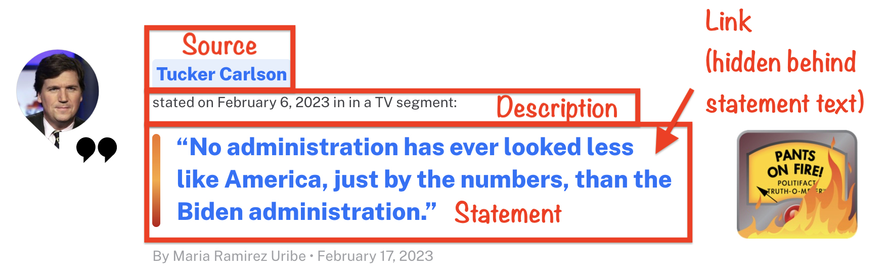

```{r setup, include=FALSE}
source('assets/setup.R')

knitr::opts_chunk$set(eval = TRUE)
library(robotstxt)
library(rvest)
library(tidyverse)

# :::red : use for pre-lab activity instructions
# :::lo : use for outlining the learning objectives

# :::green : use for tips/hints on how to complete the task
# :::yellow : use for additional information on how to use R that does not directly have anything to do with the assignment tasks

# :::frame : use when want to set some additional instructions/code/examples apart from the assignment task when explaining something about how to use R
# :::blue : same color as question box background. Not sure how much this needs to be used. 
# :::statbox : looks a lot like yellow

```

*"Fake news has become an important topic of research in a variety of disciplines including psychology, linguistics, and computer science. A critical goal in this line of work is in building systems to automatically detect misinformation in news. However, a major challenge is in collecting quality data, i.e., instances of fake and real news articles on a balanced distribution of topics."*[^lab-07-truth-o-meter-1].

In this lab we're going to scrape data from [PolitiFact's fact-checking website](https://www.politifact.com/article/2018/feb/12/principles-truth-o-meter-politifacts-methodology-i/), following a similar strategy used in the paper "Big Data and quality data for fake news and misinformation detection." 

PolitiFact has a regular feature called the "Truth-O-Meter." They focus on specific statements made by politicians, selecting the most newsworthy and significant ones, and rate them for accuracy. To do so they use on-the-record interviews and publish a list of sources with every fact-check. Statements can be rated on one of six levels of accuracy. We are going to focus on statements that PolitiFact has deemed "PANTS ON FIRE," which are statements not at all accurate and makes a ridiculous claim, and statements deemed as "MOSTLY TRUE," which are statements that are accurate but needs clarification or additional information. 

:::red
If you're interested in the topic of fake news and natural language processing, definitely check out the paper we're partly basing this lab on ["Big Data and quality data for fake news and misinformation detection"](https://journals.sagepub.com/doi/10.1177/2053951719843310). 
:::

:::lo
**LEARNING OBJECTIVES**

-   Working with R scripts
-   Web scraping from a single page
-   Writing functions
-   Iteration by mapping functions
-   Writing data out
:::

# Lab prep

```{r selectorgadget, fig.margin = TRUE, echo = FALSE}
knitr::include_graphics("img/selectorgadget.png")
```

-   Download and install the SelectorGadget for your browser.
    Once you do, you should now be able to access SelectorGadget by clicking on the icon next to the search bar in your Chrome or Firefox browser.

    -   See [here](https://chrome.google.com/webstore/detail/selectorgadget/mhjhnkcfbdhnjickkkdbjoemdmbfginb) for Chrome (recommended)
    -   See [here](https://addons.mozilla.org/en-US/firefox/addon/chropath-for-firefox) for Firefox

-   Read the following on working with R Markdown documents vs. R scripts.

## R scripts vs. R Markdown documents

Today we will be using both R scripts and R Markdown documents:

-   `.R`: R scripts are plain text files containing **only** code and brief comments,

    -   We'll use R scripts in the web scraping stage and ultimately save the scraped data as a csv.
    -   YOU CANNOT KNIT AN R SCRIPT FILE! But, of course, you can run the code in your console as normal.

-   `.Rmd`: R Markdown documents is formatted for making dynamic documents in R, and is written in markdown (an easy-to-write plain text format) and contains chunks of embedded R code. 

    -   We'll use an R Markdown document in the web analysis stage, where we start off by reading in the csv file we wrote out in the scraping stage.

Here is the organization of your repo, and the corresponding section in the lab that each file will be used for:

```{results=asis}
|-data
|  |- # to be created by you!
|-lab-07.Rmd                        # analysis
|-lab-07.Rproj
|-scripts                           # webscraping
|  |- 01-scrape-page-one.R          # scraping a single page
|  |- 02-scrape-page-function.R     # functions
|  |- 03-scrape-page-many-lies.R    # iteration
|  |- 04-scrape-page-many-truths.R  # iteration
```

# Getting started

Go to the course Posit Cloud and locate this module's project, and open the R Markdown document within it. Knit the document to make sure it compiles without errors.

Also open up each of the files that end in the `.R` suffix. You're going to be filling in information for these files as well. 

## Warm up

Update the YAML of your R Markdown file with your information and knit it.

## Packages

We'll use the **tidyverse** package for much of the data wrangling and visualization, the **robotstxt** package to check if we're allowed to scrape the data, the **rvest** package for data scraping.

These packages are already installed for you.

You can load them by running the following in your Console:

```{r eval = TRUE, message = FALSE}
library(tidyverse) 
library(robotstxt)
library(rvest)
```

## Data

This assignment does not come with any prepared datasets.

Instead you'll be scraping the data!

But before doing so, let's check that a bot has permissions to access pages on this domain.

```{r paths-allowed, warning=FALSE}
paths_allowed("https://www.politifact.com/")
```

# Exercises

## Scraping a single page

:::lo 
Work in `scripts/01-scrape-page-one.R`.
:::

:::yellow
**Tip:** To run the code within the `*.R` file, you can highlight or put your cursor next to the lines of code you want to run and hit Command+Enter for Mac or CTRL+Enter for PC. 
:::

We will start off by scraping data on the first 30 fact-checks on the "PANTS ON FIRE" page [here](https://www.politifact.com/factchecks/list/?ruling=pants-fire). Please open it in your web browser.

First, we define a new object called `first_url`, which is the link above.

Then, we read the page at this url with the `read_html()` function from the **rvest** package.

The code for this is already provided in `01-scrape-page-one.R`.

```{r}
# set url
first_url <- "https://www.politifact.com/factchecks/list/?ruling=pants-fire"

# read html page
page <- read_html(first_url)
```

For the 30 pieces on this page we will extract `statement`, `link`, `source`, and `description` information, and put these four variables in a data frame. 

```{r info-to-extract, fig.margin = TRUE, echo = FALSE}

```

### Statement

Let's start with the statement.

We make use of the SelectorGadget to identify the tags for the relevant nodes:

```{r iteminfo-h3a, fig.margin = TRUE, echo = FALSE}

```

We then run `html_nodes()` on the appropriate CSS selector

```{r, eval=FALSE}
page %>%
  html_nodes(".m-statement__quote")
```

```{r, echo=FALSE}
page %>%
  html_nodes(".m-statement__quote") %>%
  class()
```


But this just returns an object called `xml_nodeset` that is not in a particularly helpful format. But it should contain the info we need. Let's use `rvest` functions to extract.

To extract the text we use `html_text2()`:

```{r}
page %>%
  html_nodes(".m-statement__quote") %>%
  html_text2()
```

And simply save the resulting data as a vector of length 30:

```{r}
statements <- page %>%
  html_nodes(".m-statement__quote") %>%
  html_text2()
```

`r qbegin(1)`

Go ahead and fill in this information above in the appropriate place within `01-scrape-page-one.R`.

`r qend()`

### Links

The same nodes that contain the text for the statements also contains information on the links to more in-depth reporting on the fact-checks associated with each statement. This might be useful later on to have if we wanted to dig in further to extract additional information for each fact-check. 

We can extract this information using a new function from the rvest package, `html_attr()`, which extracts attributes.

A mini HTML lesson!

The following is how we define hyperlinked text in HTML:

    <a href="https://www.google.com">Seach on Google</a>

And this is how the text would look like on a webpage: [Seach on Google](https://www.google.com).

Here the text is `Seach on Google` and the `href` attribute contains the url of the website you'd go to if you click on the hyperlinked text: `https://www.google.com`.

The moral of the story is: the link is stored in the `href` attribute.

```{r}
page %>%
  html_nodes(".m-statement__quote") %>%   # same set of nodes
  html_node("a") %>%         # get information from a single node corresponding to the <a> CSS tag
  html_attr("href")          # but get href attribute instead of text
```

These don't really look like URLs as we know them though. 

These are URL fragments. Some minor work needs to be done to get them looking like actual URLs.

Click on one of fact-check statements in your browser and take note of the url of the webpage it takes you to. Think about how that URL compares to what we scraped above? How is it different? 

`r qbegin(2)`

Using `str_c()`, fix the URLs. You'll note something special happening with the `.`. Remember that whatever is being passed down by the pipeline to another function is represented by the `.`. 

`r qend()`

:::green
See the help for `str_c()` to find out how it works. You'll be using this to fix the URL fragments by creating a new character string. You want to add something to the beginning of your fragments.  
:::

### Source

`r qbegin(3)`

Fill in the blanks to scrape source names.

`r qend()`


### Description

`r qbegin(4)`

Fill in the blanks to scrape additional description information.

`r qend()`

### Put it altogether

`r qbegin(5)`

4.  Fill in the blanks to organize everything in a tibble.

`r qend()`

### Scrape the next page

`r qbegin(6)`

Scroll to the bottom and click "Next" to take you to the next page, and grab its URL. Fill in the blank to define a new object: `second_url`. Copy-paste code from top of the R script to scrape the new set of fact-checks, and save the resulting data frame as `second_thirty`.

`r qend()`


## Functions

:::lo 
Work in `scripts/02-scrape-page-function.R`.
:::

You've been using R functions, now it's time to write your own!

Let's start simple.

Here is a function that takes in an argument `x`, and adds 2 to it.

```{r}
add_two <- function(x){
  x + 2
}
```

Let's test it:

```{r}
add_two(3)
add_two(10)
```

The skeleton for defining functions in R is as follows:

```{r eval=FALSE}
function_name <- function(input){
  # do something with the input(s)
  # return something
}
```

Then, a function for scraping a page should look something like:

```{r}
function_name <- function(url){
  # read page at url
  # extract statement, link, source, and description info for n pieces on page
  # return a n x 4 tibble
}
```

:::yellow
**Reminder:** Function names should be short but evocative verbs.
:::

`r qbegin(7)`

Fill in the blanks using code you already developed in the previous exercises. Name the function `scrape_page`.

`r qend()`

Test out your new function by running the following in the console.

```{r eval=FALSE}
scrape_page(first_url)
scrape_page(second_url)
```

Does the output look right? Discuss with teammates whether you're getting the same results as before.

## Iteration

:::lo
Work in `scripts/03-scrape-page-many-lies.R`.
:::

We went from manually scraping individual pages to writing a function to do the same.

Next, we will work on making our workflow a little more efficient by using R to iterate over 20 more pages that contain information on fact-checks.

:::yellow
**Reminder:** PolitiFact has been fact-checking statements since 2007, so there are a lot of pages! We're only going to scrape from 20 of the most recent pages.
:::

That means we can develop a list of pages/URLs (where each page has have info on 30 fact-checks), and write some code that applies the `scrape_page()` function to each page, and combines the resulting data frames from each page into a single data frame with 600 rows and 4 columns.

### List of URLs

Click through the first few of the pages in the fact-checks (by clicking "Next" at the bottom of each page) and observe their URLs to confirm the following pattern:

    [sometext-prefix]page=1[sometext-suffix]    # Fact-checks 1-30
    [sometext-prefix]page=2[sometext-suffix]    # Fact-checks 31-60
    [sometext-prefix]page=3[sometext-suffix]    # Fact-checks 61-90
    [sometext-prefix]page=4[sometext-suffix]    # Fact-checks 91-120
    ...
    [sometext-prefix]page=20[sometext-suffix]   # Fact-checks 571-600

We can construct these URLs in R by pasting together three pieces: (1) a common text `prefix` for the beginning of the URL, (2) numbers starting at 0, increasing by 1, all the way up to 20, and (3) a common text `suffix` at the end of the URL. 

Two new functions are helpful for accomplishing this: `glue()` for pasting multiple pieces of text and `seq()` for generating a sequence of numbers.

`r qbegin(8)`

Fill in the blanks to construct the list of URLs.

`r qend()`

### Mapping

Finally, we're ready to iterate over the list of URLs we constructed.

We will do this by **map**ping the function we developed over the list of URLs.

There are a series of mapping functions in R (which were discussed in the lecture), and they each take the following form:

    map([x], [function to apply to each element of x])

In our case `x` is the list of URLs we just constructed and the function to apply to each element of `x` is the function we developed earlier, `scrape_page`.

And as a result we want a data frame, so we use `map_dfr` function:

```{r eval=FALSE}
map_dfr(urls, scrape_page)
```

`r qbegin(9)`

Fill in the blanks to scrape all pages, and to create a new data frame called `fact_checks_lie`. Then write out the data frame you constructed into the `data` folder so that you can use it in the analysis section. 

`r qend()`

:::green
Iterating over 20 pages to build a dataframe might take a few minutes. Be patient. And if you get an error, I discussed in the lecture one line of code you should add to the beginning of your function to be more "polite."
:::

## One more time, now with feeling!

:::lo 
Work in `scripts/04-scrape-page-many-truths.R`.
:::

PolitiFact not only has a list of "Pants on Fire" statements, they also have a list of "Mostly Truth" statements that you can find [here](https://www.politifact.com/factchecks/list/?ruling=mostly-true).

I'm going to keep the instructions minimal other than to tell you that both the "Pants on Fire" and "Mostly True" sites are set up pretty much the same way. It should be straightforward to apply all of what you have done so far to create a new 600 x 4 data frame but now with "Mostly True" statements. 

`r qbegin(10)`

Fill out the sections with the correct code, essentially copying from the code you wrote earlier, but make sure you update the text `suffix` and call this new data frame `fact_checks_truth`.

Then write out the data frame you constructed into the `data` folder so that you can use it in the data cleaning section below. 

`r qend()`

:::frame
Aim to make it to this point during today's lab
:::


## Data Cleaning

:::lo
Work in `lab-07.Rmd` for the rest of the lab.
:::

Now that we have out tidy datasets, we can do some data cleaning. Fun!

The first task is to create a new variable for each data frame to ensure we know that the statements are lies or truths, and then append the two data frames together to create a single 1200 (rows) x 5 (column) data frame. 

To add a new variable, we will use the `add_column` function. As input, just give the function the new column name and the values you want to assign to it. In our case it's either the character string `lie` or `truth`. 

Then, use the `rows_append` function to append the two data frames together. 

`r qbegin(11)`

Go ahead and add a new column to each data frame and name it as `type` for both. Make sure that the column is taking on the appropriate character string `lie` or `truth`. And then append the data frames to create a single data frame called `fact_checks`.

`r qend()`

Next, I'm most interested in cleaning up that `description` variable in our data frame. 

The information I most care about in `description` is the date. But notice that it is embedded among some text I don't really care about. So what I really want to do is separate out the date from the rest of the text.

There are several ways of doing this, but one thing I immediately notice is that the dates are always preceded by the word "on" + white space, and is followed by the white space + the word "in". So, it looks like I can separate the string in the `description` column into multiple parts based on these regular occurrences. 

Luckily, there's a function to do this called: `separate()`!

And once we have completed separating the single `description` column and extracted the date information into a new column called `date`, we need to convert it into a format R recognizes using a function from the `lubridate` package.   

`r qbegin(12)`

Fill in the blanks in to implement the data wrangling we described above. Note that this will result in some warnings when you run the code, and that's OK for what we are wanting to do. 

`r qend()`

`r qbegin(12)`

Load in the `lubridate` package (you have to do this yourself) and convert the newly created `date` variable to a format that R recognizes as a data format. 

`r qend()`

`r qbegin(13)`

Finally, print out a summary of the data frame using the `skim()` function. Make sure that `date` is recognized as the correct variable type. What is the earliest date for which we have a statement?

`r qend()`

## Analysis

For another time. Good work on the lab! 

```{r, echo=FALSE}
# `r qbegin(13)`
# 
# Print out a summary of the data frame using the `skim()` function. How many pieces have artist info missing? How many have year info missing?
# 
# `r qend()`
# 
# `r qbegin(14)`
# 
# Make a histogram of years. Use a reasonable binwidth. Do you see anything out of the ordinary?
# 
# `r qend()`
# 
# :::green
# **Hint:** You'll want to use `mutate()` and `if_else()` or `case_when()` to implement the correction.
# :::
# 
# `r qbegin(15)`
# 
# 12. Find which piece has the out of the ordinary year and go to its page on the art collection website to find the correct year for it. Can you tell why our code didn't capture the correct year information? Correct the error in the data frame and visualize the data again.
# 
# `r qend()`
# 
# `r qbegin(16)`
# 
# Who is the most commonly featured artist in the collection? Do you know them? Any guess as to why the university has so many pieces from them?
# 
# `r qend()`
# 
# :::green
# **Hint:** `str_subset()` can be helful here. You should consider how you might capture titles where the word appears as "child" and "Child".
# :::
# 
# `r qbegin(17)`
# 
# 14. Final question! How many art pieces have the word "child" in their title? Try to figure it out, and ask for help if you're stuck.
# 
# `r qend()`
```


[^lab-07-truth-o-meter-1]: Source: <https://journals.sagepub.com/doi/10.1177/2053951719843310>
