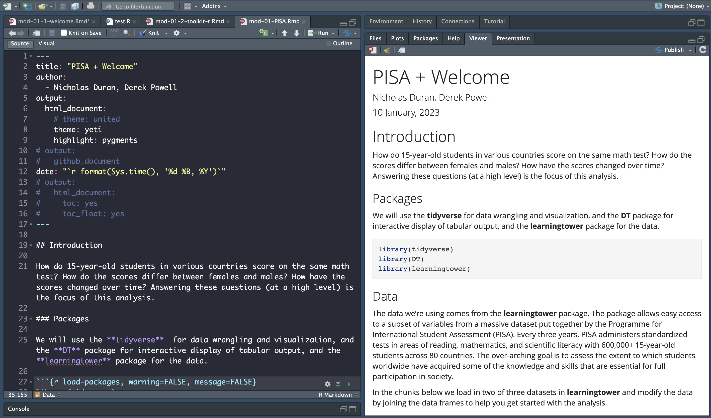

```{r child = "setup.Rmd"}

```

```{r packages, echo=FALSE, message=FALSE, warning=FALSE}
library(tidyverse)
library(emo)
packageVersion("xaringan")
```


## Data science

.pull-left-wide[
- Data science is an exciting discipline that allows you to turn raw data into understanding, insight, and knowledge. 

- We're going to learn to do this in a `tidy` way -- more on that later!

- This is a course on introduction to data science, with an emphasis on critical thinking.
]

---

## Course FAQ

.pull-left-wide[
**Q - What data science background does this course assume?**  
A - None.

**Q - Is this an intro stat course?**  
A - While statistics $\ne$ data science, they are very closely related and have tremendous of overlap. Hence, this course is a great way to get started with statistics. However this course is *not* your typical high school statistics course.

**Q - Will we be doing computing?**   
A - Yes.
]

---

## Course FAQ

.pull-left-wide[
**Q - Is this an intro CS course?**  
A - No, but many themes are shared.

**Q - What computing language will we learn?**  
A - R.

**Q: Why not language X?**  
A: We can discuss that over `r emo::ji("coffee")`.
]

---

# Launch pad for all course material...

...where you can find most everything except for HW and LAB starter files

# Canvas

# Posit

---

class: middle

# Software

---

```{r echo=FALSE, out.width="75%", fig.align="left"}
knitr::include_graphics("mod-01-1-welcome/excel.png")
```

---

```{r echo=FALSE, out.width="50%", fig.align="left"}
knitr::include_graphics("mod-01-1-welcome/r.png")
```

---

```{r echo=FALSE, out.width="73%", fig.align="left"}
knitr::include_graphics("mod-01-1-welcome/rstudio.png")
```

---

class: middle

# Data science life cycle

---

```{r echo=FALSE, out.width="90%", fig.align="left"}
knitr::include_graphics("mod-01-1-welcome/data-science-cycle/data-science-cycle.001.png")
```

---

```{r echo=FALSE, out.width="90%", fig.align="left"}
knitr::include_graphics("mod-01-1-welcome/data-science-cycle/data-science-cycle.002.png")
```

---

```{r echo=FALSE, out.width="90%", fig.align="left"}
knitr::include_graphics("mod-01-1-welcome/data-science-cycle/data-science-cycle.003.png")
```

---

```{r echo=FALSE, out.width="90%", fig.align="left"}
knitr::include_graphics("mod-01-1-welcome/data-science-cycle/data-science-cycle.004.png")
```

---

```{r echo=FALSE, out.width="90%", fig.align="left"}
knitr::include_graphics("mod-01-1-welcome/data-science-cycle/data-science-cycle.005.png")
```

---

```{r echo=FALSE, out.width="90%", fig.align="left"}
knitr::include_graphics("mod-01-1-welcome/data-science-cycle/data-science-cycle.006.png")
```

---

.pull-left[
```{r echo=FALSE, out.width="100%", fig.align="left"}

```
]
.pull-right[
```{r echo=FALSE, out.width="90%", fig.align="right"}
knitr::include_graphics("mod-01-1-welcome/data-science-cycle/data-science-cycle.006.png")
```
]

---

.pull-left[
```{r echo=FALSE, out.width="100%", fig.align="left"}

```
]
.pull-right[
```{r echo=FALSE, out.width="90%", fig.align="right"}
knitr::include_graphics("mod-01-1-welcome/data-science-cycle/data-science-cycle.006.png")
```
```{r echo=FALSE, out.width="90%", fig.align="right"}
knitr::include_graphics("mod-01-1-welcome/lec1_ex2.png")

# travel <- tribble(
#   ~date,              ~season,
#   "23 January 2017",  "winter",
#   "4 March 2017",     "spring",
#   "14 June 2017",     "summer",
#   "1 September 2017", "fall",
#   "...", "..."
# )
# travel
```
]

---

```{r echo=FALSE, out.width="90%", fig.align="left"}
knitr::include_graphics("mod-01-1-welcome/data-science-cycle/data-science-cycle.007.png")
```

---

```{r echo=FALSE, out.width="90%", fig.align="left"}
knitr::include_graphics("mod-01-1-welcome/data-science-cycle/data-science-cycle.008.png")
```

---

```{r echo=FALSE, out.width="90%", fig.align="left"}
knitr::include_graphics("mod-01-1-welcome/data-science-cycle/data-science-cycle.009.png")
```

---

```{r echo=FALSE, out.width="100%", fig.align="left"}


# 
```

---

```{r echo=FALSE, out.width="85%", fig.align="center"}


# background-image: url("mod-01-1-welcome/PISA_assessment.png")
```


---

class: middle

# Let's dive in and do a bit of live-coding

---

# To Do

- Let's go over syllabus and schedule

- Let's go over Canvas setup

- Let's go over setup for Week 1 HW and Lab (go to next slide)

---

## Getting Started I

- Follow instructions on the "Info on Posit Cloud (for HWs, Labs, and All Analyses)" page on Canvas for getting an account

- Lets upload the HW starter file for Canvas. Download the `.RMD` file from the instructions page on Canvas to your computer. In RStudio, go to the `Files` tab in the bottom-right console and then click `Upload` document to upload the `.RMD` file.  

- Click the `.RMD` file to see it Viewer. You may be automatically asked to install a package called `tidyverse`. If so, accept the install. Otherwise I will show you how to install manually using something called `install.packages()`

- In the Console window, type `install.packages("devtools")` then type `devtools::install_github("asucbi/bdsdata")`

- Knit the starter file and see what happens

---

## Getting Started II

- Now that we have a PDF file, go ahead and export it to your harddrive to upload to Canvas (hit the checkmark next to the file and go to the `More` dropdown menu and click `Export`)

- Lets do a little setup to change the feel of things (change the look, view in panel)


