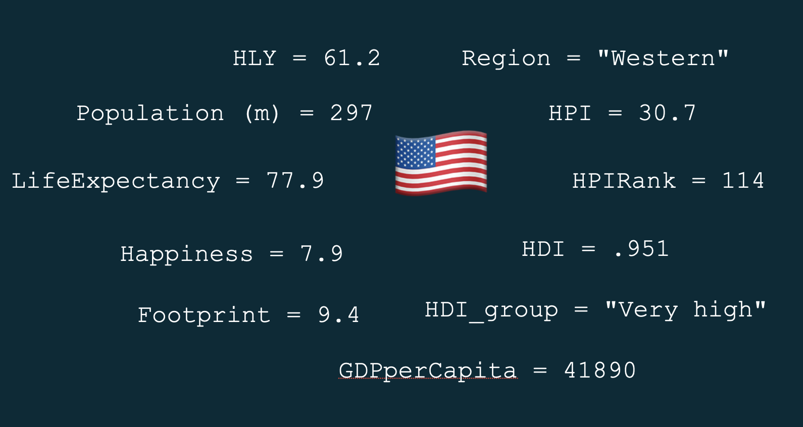
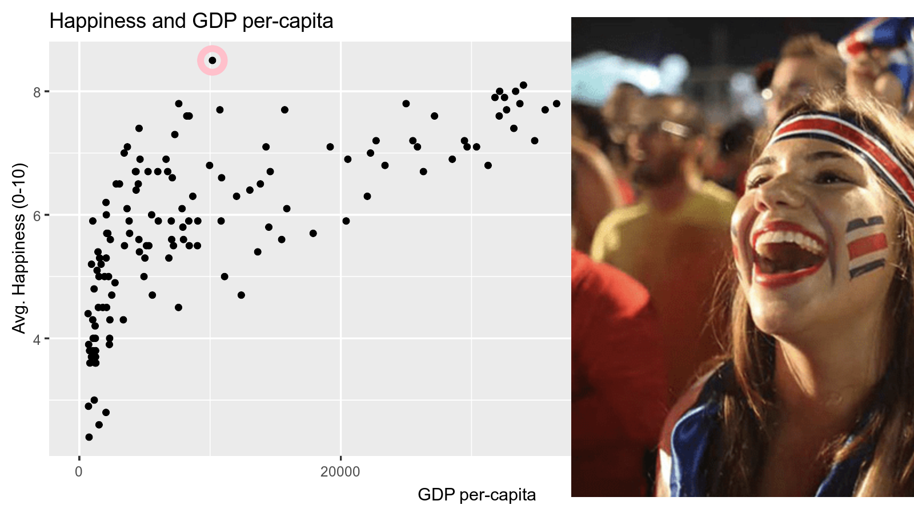

```{r child = "setup.Rmd"}
```

```{r packages, echo=FALSE, message=FALSE, warning=FALSE}
library(tidyverse)
library(magick)
library(Tmisc)
library(dsbox)

happy <- read_csv("https://www.lock5stat.com/datasets3e/HappyPlanetIndex.csv") %>% 
  mutate(
    Region = case_when(
      Region == 1 ~ "Latin America",
      Region == 2 ~ "Western",
      Region == 3 ~ "Middle East",
      Region == 4 ~ "SubSaharan Africa",
      Region == 5 ~ "South Asia",
      Region == 6 ~ "East Asia",
      Region == 7 ~ "Former Soviet",
      TRUE ~ NA_character_
    ),
    HDI_group = ordered(case_when(
      HDI <= .55 ~ "Low",
      HDI < .699 ~ "Medium",
      HDI < .799 ~ "High",
      HDI >= .799 ~ "Very high",
      is.na(HDI) ~ NA_character_
    ), levels = c("Low","Medium","High","Very high")
  )
  )
```

class: middle

# What is in a dataset?

---

## Dataset terminology

- Each row is an **observation**
- Each column is a **variable**

.small[

```{r message=FALSE}
happy
```

]

---

## United States of America


```{r echo = FALSE, warning = FALSE, cache = TRUE, out.width = "80%"}

```

---

## What's in the Happy Planet Index data?

Take a `glimpse` at the data:

```{r}
glimpse(happy)
```

---

.question[
How many rows and columns does this dataset have?
What does each row represent?
What does each column represent?
]

```{r}
glimpse(happy)
```

---

.question[
How many rows and columns does this dataset have?
]

.pull-left[
```{r}
nrow(happy) # number of rows
ncol(happy) # number of columns
dim(happy)  # dimensions (row column)
```
]

---

class: middle

# Exploratory data analysis

---

## What is EDA?

- Exploratory data analysis (EDA) is an approach to analysing data sets to summarize its main characteristics
- Often, this is visual -- this is what we'll focus on first
- But we might also calculate summary statistics and perform data wrangling/manipulation/transformation at (or before) this stage of the analysis -- this is what we'll focus on next

---

## Does money buy happiness?

.question[ 
How would you describe the relationship between a country's GDP per capita and average happiness?
What other variables would help us understand data points that don't follow the overall trend?
Which is that not-that-rich but very happy country?
]

```{r fig.width = 8, warning = FALSE, echo=FALSE, out.width = "50%"}
plt_example <- ggplot(data = happy, mapping = aes(y = Happiness, x = GDPperCapita)) +
  geom_point() +
  labs(title = "Happiness and GDP per-capita",
       y = "Avg. Happiness (0-10)", x = "GDP per-capita") +
  geom_point(data = happy %>% filter(Country == "Costa Rica"), size = 5, pch = 1, color = "pink", stroke = 3)

plt_example
```

---

## Costa Rica!

```{r echo = FALSE, warning = FALSE, cache = TRUE, out.width = "80%"}
# costa_rica <- image_read("img/costa-rica.png")
# 
# fig <- image_graph(width = 1600, height = 900, res = 200)
# plt_example
# dev.off()
# 
# out <- fig %>% image_composite(costa_rica, offset = "+1000+30")
# 
# image_write(out, "img/crplot.png", format = "png")
# 


```

---

class: middle

# Data visualization

---

## Data visualization

> *"The simple graph has brought more information to the data analyst's mind than any other device." --- John Tukey*

- Data visualization is the creation and study of the visual representation of data
- Many tools for visualizing data -- R is one of them
- Many approaches/systems within R for making data visualizations -- **ggplot2** is one of them, and that's what we're going to use

---

## ggplot2 $\in$ tidyverse

.pull-left[
```{r echo=FALSE, out.width="80%"}
knitr::include_graphics("img/ggplot2-part-of-tidyverse.png")
```
] 
.pull-right[ 
- **ggplot2** is tidyverse's data visualization package 
- `gg` in "ggplot2" stands for Grammar of Graphics 
- Inspired by the book **Grammar of Graphics** by Leland Wilkinson
]

---

## Grammar of Graphics

.pull-left-narrow[
A grammar of graphics is a tool that enables us to concisely describe the components of a graphic
]
.pull-right-wide[
```{r echo=FALSE, out.width="50%"}
knitr::include_graphics("img/grammar-of-graphics.png")
```
]

.footnote[ Source: [BloggoType](http://bloggotype.blogspot.com/2016/08/holiday-notes2-grammar-of-graphics.html)]

---

## Money vs. Happiness

```{r mass-height, fig.width = 8, out.width = "50%"}
ggplot(data = happy, mapping = aes(y = Happiness, x = GDPperCapita)) +
  geom_point() +
  labs(title = "Happiness and GDP per-capita",
       y = "Avg. Happiness (0-10)", x = "GDP per-capita") +
  geom_point(data = happy %>% filter(Country == "Costa Rica"), size = 5, pch = 1, color = "pink", stroke = 3)
```

---

.question[ 
- What are the functions doing the plotting?
- What is the dataset being plotted?
- Which variables map to which features (aesthetics) of the plot?
- What does the warning mean?<sup>+</sup>
]

```{r ref.label="mass-height", fig.show = "hide"}
```

.footnote[
<sup>+</sup>Suppressing warning to subsequent slides to save space
]

---

## Hello ggplot2!

.pull-left-wide[
- `ggplot()` is the main function in ggplot2
- Plots are constructed in layers
- Structure of the code for plots can be summarized as

```{r eval = FALSE}
ggplot(data = [dataset], 
       mapping = aes(x = [x-variable], y = [y-variable])) +
   geom_xxx() +
   other options
```

- The ggplot2 package comes with the tidyverse

```{r}
library(tidyverse)
```

- For help with ggplot2, see [ggplot2.tidyverse.org](http://ggplot2.tidyverse.org/)
]

---

class: middle

# Why do we visualize?

---

## Anscombe's quartet

```{r quartet-for-show, eval = FALSE, echo = FALSE}
library(Tmisc)
quartet
```

.pull-left[
```{r quartet-view1, echo = FALSE}
quartet[1:22,]
```
] 
.pull-right[
```{r quartet-view2, echo = FALSE}
quartet[23:44,]
```
]

---

## Summarising Anscombe's quartet

```{r quartet-summary}
quartet %>%
  group_by(set) %>%
  summarise(
    mean_x = mean(x), 
    mean_y = mean(y),
    sd_x = sd(x),
    sd_y = sd(y),
    r = cor(x, y)
  )
```

---

## Visualizing Anscombe's quartet

```{r quartet-plot, echo = FALSE, out.width = "80%", fig.asp = 0.5}
ggplot(quartet, aes(x = x, y = y)) +
  geom_point() +
  facet_wrap(~ set, ncol = 4)
```

---


## Age at first kiss

.question[ 
Do you see anything out of the ordinary?
]

```{r echo = FALSE, warning = FALSE}
ggplot(student_survey, aes(x = first_kiss)) +
  geom_histogram(binwidth = 1) +
  labs(
    title = "How old were you when you had your first kiss?", 
    x = "Age (years)", y = NULL
    )
```

---

## Facebook visits

.question[ 
How are people reporting lower vs. higher values of FB visits?
]

```{r echo = FALSE, warning = FALSE}
ggplot(student_survey, aes(x = fb_visits_per_day)) +
  geom_histogram(binwidth = 1) +
  labs(
    title = "How many times do you go on Facebook per day?", 
    x = "Number of times", y = NULL
    )
```


## Money and happiness

- The correlation between money and happiness is $r =$ `r cor(happy$Happiness, happy$GDPperCapita, use = "complete.obs") %>% round(3)`. 
- But does that doesn't tell the whole story

```{r fig.width = 8, warning = FALSE, echo=FALSE, out.width = "50%"}
ggplot(data = happy, mapping = aes(y = Happiness, x = GDPperCapita)) +
  geom_point() +
  labs(title = "Happiness and GDP per-capita",
       y = "Avg. Happiness (0-10)", x = "GDP per-capita")
```

---