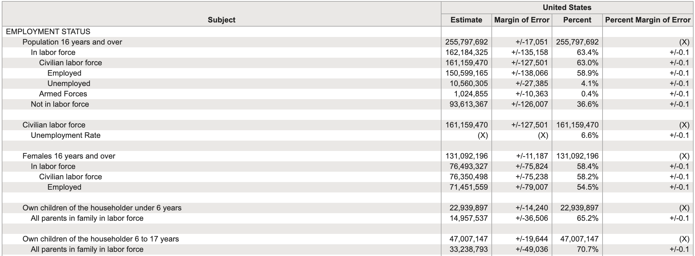

```{r, echo=FALSE, message=FALSE, warning=FALSE}
# <!-- https://github.com/yihui/xaringan/issues/29 -->
# <!-- # if not rendering correctly with moon reader, need to use "cast_from": xaringan::inf_mr(cast_from = '../'). Grabbing files from up the directory sometimes causes problems. --> But note, when opening in HTML, it looks fine, just a problem here in preview. 
```

```{r child = "../setup.Rmd"}

```

```{r packages, echo=FALSE, message=FALSE, warning=FALSE}
library(tidyverse)
```

## Tidy data

>Happy families are all alike; every unhappy family is unhappy in its own way. 
>
>Leo Tolstoy


???
We've been talking about the tidyverse for awhile now and it's time to actually define what we mean by tidy data. Now, how does this Tolstoy quote possibly have anything to do with tidy data? Well, tidy data is like a happy family. 

--

.pull-left[
**Characteristics of tidy data:**

- Each variable forms a column.
- Each observation forms a row.
- Each type of observational unit forms a table.
]

???
As you will see, for tidy data, all variables are arranged as columns, each observation forms a row, and each type of observational unit forms a table. Datasets arranged in the tidy data way are all alike, happy. 

--
.pull-right[
**Characteristics of untidy data:**

!@#$%^&*()
]

???
But, unhappy datasets, well, these can be untidy in many, many ways. The way variables, observations, etc. are arranged are unsystematic and might work for one kind of analysis, but fail for another kind of analysis. 

---

## 

.question[
What makes this data not tidy?
]

```{r hyperwar-airplanes-on-hand, echo=FALSE, out.width="90%", fig.align = "center", caption = "WW2 Army Air Force combat aircraft", out.width = "70%"}
knitr::include_graphics("img/hyperwar-airplanes-on-hand.png")
```

.footnote[
Source: [Army Air Forces Statistical Digest, WW II](https://www.ibiblio.org/hyperwar/AAF/StatDigest/aafsd-3.html)
]

???
So lets start with some examples of what makes data untidy. These datasets are all found in the wild. This one here comes from a hobbyist maintaining some information on WWII aircrafts. This is only a snippet from a much larger table. So, what makes this untidy? Well, lets start with how year is displayed. Look at 1939 here, in it's own merged cell, with the months underneath supposed to belong to that year. But if we wanted to make this tidy by our standards, we would replace the first column with one simply labeled "year" and then add another column called "month." Why? Because each variable forms its own column. Then, for our new "year" column, in the first row you would have 1939, and in our new "month" column, staying in the first row, you would have July. Why? Because each observation, which happens to be for July 1939, would form a row. Now, what would you have in the second row? Well, "year" would stay 1939, and "month," our new observation, changes to August. 

Ok. What other issues do we have? This merged row here with "Germany invades Poland" are obviously important when visualizing the data, but no good if we want to run it in future analyses. We could code this information as an additional column. It could be some variable we could code as some sort of pre or post event.  

---

.question[
What makes this data not tidy?
]

<br>

```{r hiv-est-prevalence-15-49, echo=FALSE, out.width="95%", fig.align = "center", caption = "Estimated HIV prevalence among 15-49 year olds", out.width = "70%"}
knitr::include_graphics("img/hiv-est-prevalence-15-49.png")
```

.footnote[
Source: [Gapminder, Estimated HIV prevalence among 15-49 year olds](https://www.gapminder.org/data)
]

???
Here's another wild and untidy dataset from "Gapminder," which is a really cool website that maintains lots and lots of country level information. Here we're looking at the estimated HIV prevalence among 15 to 19 year olds in various countries across various years. What makes this guy untidy? For now, lets focus on that orange cell A1. We basically have the title for our data in that column header. But that is not what we want. What we want is a nice succinct label for that variable. The most obvious label would be "country." And we have each individual year as separate variables across columns. Technically, not wrong. But I will be showing you later a way to "reshape" this data where we just have a single column/variable called "year" that makes things way easier for creating graphs and to run analyses.     

---

.question[
What makes this data not tidy?
]

<br>

```{r us-general-economic-characteristic-acs-2017, echo=FALSE, out.width="95%", fig.align = "center", caption = "US General Economic Characteristics, ACS 2017", out.width = "85%"}

```

.footnote[
Source: [US Census Fact Finder, General Economic Characteristics, ACS 2017](https://factfinder.census.gov/faces/tableservices/jsf/pages/productview.xhtml?pid=ACS_17_5YR_DP03&src=pt)
]

???
Ok, moving on here is some data from the US Census. Yowzers. So, this format is pretty typical of census data where what is released is aggregated information about a population instead of individual-level information. So, what's the  problem here for a tidy dataset? I mean, it looks like we have rows and columns we can start manipulating. But, unfortunately, what we have here is a summary table where the columns do not correspond to unique variables and the rows do not capture "raw data" at the level of some observation. Thus, this is a lesson in distinguishing between a raw dataset (which this is not) versus a table of summary statistics. 

---

## Displaying vs. summarising data

.panelset[

.panel[.panel-name[Output]

.pull-left[
```{r echo=FALSE}
starwars %>%
  select(name, height, mass)
```
]
.pull-right[
```{r echo=FALSE}
starwars %>%
  group_by(gender) %>%
  summarize(avg_ht = mean(height, na.rm = TRUE))
```
]

]

.panel[.panel-name[Code]

.pull-left[
```{r eval=FALSE}
starwars %>%
  select(name, height, mass)
```
]
.pull-right[
```{r eval=FALSE}
starwars %>%
  group_by(gender) %>%
  summarize(
    avg_ht = mean(height, na.rm = TRUE)
  )
```
]

]

]

???
OK, finally.. some star wars data. So in the dataframe on the left we have the names, heights, and masses of various star wars characters. I could have had another column/variable called "gender" if I had wanted, as this is also an interesting characteristic of each individual.

Note that the number of rows is 87, which is the number of individual-level observations in the original dataset. In this case, there are 87 difference characters. 

Now, the dataframe on the right should look/feel different to you. What we have here is gender as one of the columns and average height as the other column. So this also looks tidy in a way. I have rows and columns - but it's important to note that this is actually a summarized version of the raw data. What I did was aggregate across gender and height, meaning, of the 87 characters, the female characters are on average XX and the male characters XX. 

This summary data might be exactly what I need for whatever analysis I'm doing, but it is critical to note that if all I had was this summary table, it's impossible to go back to the raw data set. So you want to, as much as possible, maintain your data in its raw format and then create summary statistics as needed. Never overwrite your original raw dataset. 

And if you look at the code that generated these two tables, note that I started with the complete raw dataset, selected a few columns from it, but the right hand side, what I'm doing is grouping my data by gender and then calling average height to create summary statistics. Never do I overwrite my data. Moreover, on a separate note, what I'm doing here, starting with raw data and then doing various wrangling steps on it to create new variables or to calculate summary statistics - is the sort of stuff that we're going to be focusing on this week. See you in the next lecture. 


