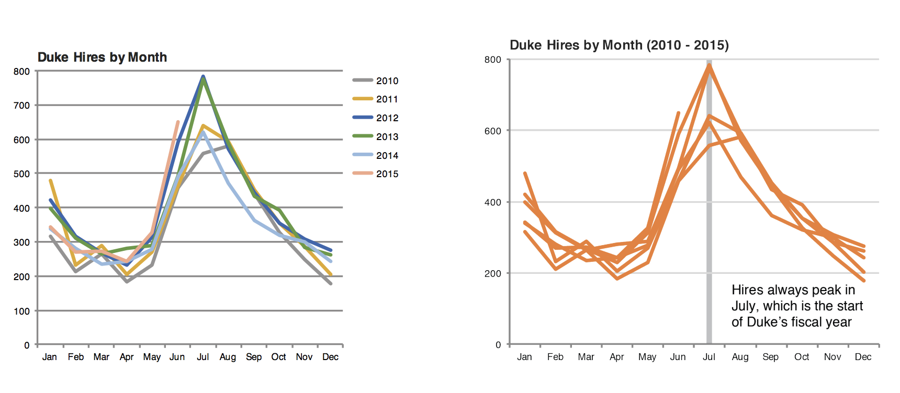

```{r child = "setup.Rmd"}
```

```{r packages, echo = FALSE, message=FALSE, warning=FALSE}
library(tidyverse)
library(scales)
```

class: middle

# Designing effective visualizations

---

## Keep it simple

.pull-left-narrow[
```{r pie-3d, echo = FALSE, out.width="100%"}
knitr::include_graphics("img/pie-3d.jpg")
```
]
.pull-right-wide[
```{r pie-to-bar, echo = FALSE, out.width="100%"}
d <- tribble(
  ~category, ~value,
  "Cutting tools", 0.03,
  "Buildings and administration", 0.22,
  "Labor", 0.31,
  "Machinery", 0.27,
  "Workplace materials", 0.17
)
ggplot(d, aes(x = fct_reorder(category, value), y = value)) +
  geom_col() +
  theme_minimal() +
  coord_flip() +
  labs(x = "", y = "")
```
]


---

## Use	color	to	draw	attention

.pull-left[
```{r echo = FALSE, out.width="100%"}
d %>%
  mutate(category = str_replace(category, " ", "\n")) %>%
  ggplot(aes(x = category, y = value, fill = category)) +
  geom_col() +
  theme_minimal() +
  labs(x = "", y = "") +
  theme(legend.position = "none")
```
]
.pull-right[
```{r echo = FALSE, out.width="100%"}
ggplot(d, aes(x = fct_reorder(category, value), y = value, fill = category)) +
  geom_col() +
  theme_minimal() +
  coord_flip() +
  labs(x = "", y = "") +
  scale_fill_manual(values = c("red", rep("gray", 4))) +
  theme(legend.position = "none")
```
]

---

## Tell a story

```{r echo = FALSE, out.width = "80%"}

```

.footnote[
Credit: Angela Zoss and Eric Monson, Duke DVS
]

---

class: middle

# Principles	for	effective	visualizations

---

## Principles	for	effective	visualizations

- Order matters
- Put long categories on the y-axis
- Keep	scales consistent
- Select meaningful colors
- Use meaningful and nonredundant labels

---

## Data

In January 2023, YouGovAmerica survey asked 915 US adults the following question:

> Which ONE, if any, of the following statements do you MOST agree with?
>
>- Most robots have already developed higher levels of intelligence than humans
>- Robots will be able to develop higher levels of intelligence than humans in the future
>- Robots will never be able to develop higher levels of intelligence than humans

```{r robots, echo = FALSE}
# robots <- tibble(
#   opinion = c(
#     rep("Most robots have already developed higher levels of intelligence than humans", 238), rep("Robots will be able to develop higher levels of intelligence than humans in the future", 676), rep("Robots will never be able to develop higher levels of intelligence than humans", 387)
#   ),
#   education = c(
#     rep("NO HS", 37), rep("High School graduate", 96), rep("Some College", 50), rep("4-year", 40), rep("Post-grad", 15),
#     rep("NO HS", 28), rep("High School graduate", 251), rep("Some College", 156), rep("4-year", 157), rep("Post-grad", 84),
#     rep("NO HS", 11), rep("High School graduate", 160), rep("Some College", 83), rep("4-year", 80), rep("Post-grad", 53)
#   )
# )

robots <- tibble(
  opinion = c(
    rep("Most robots have already developed higher levels of intelligence than humans", 116), rep("Robots will be able to develop higher levels of intelligence than humans in the future", 334), rep("Robots will never be able to develop higher levels of intelligence than humans", 190)
  ),
  education = c(
    rep("NO HS", 20), rep("High School graduate", 49), rep("Some College", 20), rep("4-year", 17), rep("Post-grad", 10),
    rep("NO HS", 17), rep("High School graduate", 119), rep("Some College", 71), rep("4-year", 80), rep("Post-grad", 47),
    rep("NO HS", 7), rep("High School graduate", 81), rep("Some College", 38), rep("4-year", 43), rep("Post-grad", 21)
  )
)

```

---

```{r default-education, echo=FALSE}
robots %>% ggplot(aes(x=education)) +
  geom_bar()
```

> Lets start beautifying

---

class: middle

# Order matters

---

## Alphabetical order is rarely ideal

.panelset[

.panel[.panel-name[Plot]
```{r ref.label="default-education2", echo = FALSE}
```
]

.panel[.panel-name[Code]
```{r default-education2, fig.show = "hide"}
ggplot(robots, aes(x = education)) +
  geom_bar()
```
]

]

---

## Order by frequency

.panelset[

.panel[.panel-name[Plot]
```{r ref.label="infreq", echo = FALSE}
```
]

.panel[.panel-name[Code]

`fct_infreq`: Reorder factors' levels by frequency

```{r infreq, fig.show = "hide"}
ggplot(robots, aes(x = fct_infreq(education))) + #<<
  geom_bar()
```
]

]

---

## Use inherent level order

.panelset[

.panel[.panel-name[Relevel]

`fct_relevel`: Reorder factor levels using a custom order

```{r relevel, fig.show = "hide"}
robots <- robots %>%
  mutate(
    education = fct_relevel( #<<
      education, #<<
      "NO HS", "High School graduate", "Some College", "4-year", "Post-grad" #<<
    ) #<<
  )
```
]

.panel[.panel-name[Plot]
```{r relevel-plot, echo=FALSE}
ggplot(robots, aes(x = education)) +
  geom_bar()
```
]

]

---

class: middle

# Put long categories on the y-axis

---

## Long categories can be hard to read

```{r ref.label="relevel-plot", echo = FALSE}
```

---

## Move them to the y-axis

.panelset[

.panel[.panel-name[Plot]
```{r ref.label="flip", echo = FALSE}
```
]

.panel[.panel-name[Code]

```{r flip, fig.show = "hide"}
ggplot(robots, aes(y = education)) + #<<
  geom_bar() +
  labs(x = "count", y = "education") 
```
]

]

---

## And reverse the order of levels

.panelset[

.panel[.panel-name[Plot]
```{r ref.label="rev", echo = FALSE}
```
]

.panel[.panel-name[Code]

`fct_rev`: Reverse order of factor levels

```{r rev, fig.show = "hide"}
ggplot(robots, aes(y = fct_rev(education))) + #<<
  geom_bar() +
  labs(x = "count", y = "education")
```
]

]

---

## Clean up labels

.panelset[

.panel[.panel-name[Recode]

`fct_recode`: Change factor levels by hand

```{r recode, fig.show = "hide"}
robots <- robots %>%
  mutate(
    education = fct_recode( #<<
      education, #<<
      "High School" = "High School graduate", #<<
      "BA / BS" = "4-year", #<<
      "Some College" = "Some College", #<<
      "Graduate" = "Post-grad", #<<
      "No High School" = "NO HS" #<<
    ) #<<
  )
```
]

.panel[.panel-name[Plot]
```{r recode-plot, echo=FALSE}
ggplot(robots, aes(y = fct_rev(education))) +
  geom_bar() +
  labs(x = "count", y = "education")
```
]

]

---

## Clean up labels

.panelset[

.panel[.panel-name[Plot]
```{r ref.label="labels-again", echo = FALSE}
```
]

.panel[.panel-name[Code]

```{r labels-again, fig.show = "hide"}
ggplot(robots, aes(y = fct_rev(education))) +
  geom_bar() +
  labs(x = "Count", y = "Education") #<<
```
]

]

---

## Long labels; need serious clean up

.panelset[

.panel[.panel-name[Plot]
```{r opinion-data, echo = FALSE}
ggplot(robots, aes(x = opinion)) +
  geom_bar()
```
]

.panel[.panel-name[Labels]

> Most robots have already developed higher levels of intelligence than humans
>- "Already surpassed

> Robots will be able to develop higher levels of intelligence than humans in the future
>- "Surpass in future

> Robots will never be able to develop higher levels of intelligence than humans
>- "Never surpass"

]

]

---

## Clean up labels

.panelset[

.panel[.panel-name[Recode]

`fct_recode`: Change factor levels by hand

```{r recode-opinion, fig.show = "hide"}
robots <- robots %>%
  mutate(
    opinion = fct_recode( #<<
      opinion, #<<
      "Already Surpassed" = "Most robots have already developed higher levels of intelligence than humans", #<<
      "Surpass in Future" = "Robots will be able to develop higher levels of intelligence than humans in the future", #<<
      "Never Surpass" = "Robots will never be able to develop higher levels of intelligence than humans" #<<
    ) #<<
  )
```
]

.panel[.panel-name[Plot]
```{r recode-opinion-plot, echo=FALSE}
ggplot(robots, aes(x = opinion)) +
  geom_bar()
```
]

]

---

class: middle

# Pick a purpose

---

## Segmented bar plots can be hard to read

.panelset[

.panel[.panel-name[Plot]
```{r ref.label="segment", echo = FALSE}
```
]

.panel[.panel-name[Code]

```{r segment, fig.show = "hide"}
ggplot(robots, aes(y = education, fill = opinion)) + #<<
  geom_bar()
```
]

]

---

## Use facets

.panelset[

.panel[.panel-name[Plot]
```{r ref.label="facet", echo = FALSE, fig.width=12, fig.height=12, fig.asp = 0.45, out.width = "90%"}
```
]

.panel[.panel-name[Code]

```{r facet, fig.show = "hide"}
ggplot(robots, aes(y = opinion, fill = education)) +
  geom_bar() +
  facet_wrap(~education, nrow = 1) #<<
```
]

]

---

## Avoid redundancy?

```{r echo = FALSE, fig.width=12, fig.height=12, fig.asp = 0.45, out.width = "90%"}
ggplot(robots, aes(y = opinion)) +
  geom_bar() +
  facet_wrap(~education, nrow = 1)
```

---

## Redundancy can help tell a story

.panelset[

.panel[.panel-name[Plot]
```{r ref.label="facet-fill", echo = FALSE, fig.width=12, fig.height=12, fig.asp = 0.45, out.width = "90%"}
```
]

.panel[.panel-name[Code]

```{r facet-fill, fig.show = "hide"}
ggplot(robots, aes(y = opinion, fill = opinion)) +
  geom_bar() +
  facet_wrap(~education, nrow = 1)
```
]

]

---

## Be selective with redundancy

.panelset[

.panel[.panel-name[Plot]
```{r ref.label="hide-legend", echo = FALSE, fig.width=12, fig.height=12, fig.asp = 0.45, out.width = "90%"}
```
]

.panel[.panel-name[Code]

```{r hide-legend, fig.show = "hide"}
ggplot(robots, aes(y = opinion, fill = opinion)) +
  geom_bar() +
  facet_wrap(~education, nrow = 1) +
  guides(fill = "none") #<<
```
]

]

---

## Use informative labels

.panelset[

.panel[.panel-name[Plot]
```{r ref.label="informative-label", echo = FALSE, fig.width=12, fig.height=12, fig.asp = 0.45, out.width = "90%"}
```
]

.panel[.panel-name[Code]

```{r informative-label, fig.show = "hide"}
ggplot(robots, aes(y = opinion, fill = opinion)) +
  geom_bar() +
  facet_wrap(~education, nrow = 1) +
  guides(fill = "none") +
  labs(
    title = "Robot intelligence: Have they surpassed humans?", #<<
    x = NULL, y = NULL
  )
```
]

]

---

## A bit more info

.panelset[

.panel[.panel-name[Plot]
```{r ref.label="more-info", echo = FALSE, fig.width=12, fig.height=12, fig.asp = 0.45, out.width = "90%"}
```
]

.panel[.panel-name[Code]

```{r more-info, fig.show = "hide"}
ggplot(robots, aes(y = opinion, fill = opinion)) +
  geom_bar() +
  facet_wrap(~education, nrow = 1) +
  guides(fill = "none") +
  labs(
    title = "Robot intelligence: Have they surpassed humans?",
    subtitle = "YouGov Survey Results, 05 January 2023", #<<
    caption = "Source: https://today.yougov.com/topics/politics/trackers/robot-intelligence", #<<
    x = NULL, y = NULL
  )
```
]

]

---

## Let's do better

.panelset[

.panel[.panel-name[Plot]
```{r ref.label="short-link", echo = FALSE, fig.width=12, fig.height=12, fig.asp = 0.45, out.width = "90%"}
```
]

.panel[.panel-name[Code]

```{r short-link, fig.show = "hide"}
ggplot(robots, aes(y = opinion, fill = opinion)) +
  geom_bar() +
  facet_wrap(~education, nrow = 1) +
  guides(fill = "none") +
  labs(
    title = "Robot intelligence: Have they surpassed humans?",
    subtitle = "YouGov Survey Results, 05 January 2023",
    caption = "Source: http://bit.ly/3JubdGu", #<<
    x = NULL, y = NULL
  )
```
]

]

---

## Fix up facet labels

.panelset[

.panel[.panel-name[Plot]
```{r ref.label="label-wrap", echo = FALSE, fig.width=12, fig.height=12, fig.asp = 0.45, out.width = "90%"}
```
]

.panel[.panel-name[Code]

```{r label-wrap, fig.show = "hide"}
ggplot(robots, aes(y = opinion, fill = opinion)) +
  geom_bar() +
  facet_wrap(~education,
             nrow = 1,
            labeller = label_wrap_gen(width = 12) #<<
  ) +
  guides(fill = "none") +
  labs(
    title = "Robot intelligence: Have they surpassed humans?",
    subtitle = "YouGov Survey Results, 05 January 2023",
    caption = "Source: http://bit.ly/3JubdGu",
    x = NULL, y = NULL
  )
```
]

]

---

class: middle

# Select meaningful colors

---

## Rainbow colors not always the right choice

```{r ref.label="label-wrap", echo = FALSE, fig.width=12, fig.height=12, fig.asp = 0.45, out.width = "90%"}
```

---

## Manually choose colors when needed

.panelset[

.panel[.panel-name[Plot]
```{r ref.label="red-green", echo = FALSE, fig.width=12, fig.height=12, fig.asp = 0.45, out.width = "90%"}
```
]

.panel[.panel-name[Code]

```{r red-green, fig.show = "hide"}
ggplot(robots, aes(y = opinion, fill = opinion)) +
  geom_bar() +
  facet_wrap(~education, nrow = 1, labeller = label_wrap_gen(width = 12)) +
  guides(fill = "none") +
  labs(title = "Robot intelligence: Have they surpassed humans?",
    subtitle = "YouGov Survey Results, 05 January 2023",
    caption = "Source: http://bit.ly/3JubdGu",
       x = NULL, y = NULL) +
  scale_fill_manual(values = c( #<<
    "Never Surpass" = "red", #<<
    "Already Surpassed" = "green", #<<
    "Surpass in Future" = "gray" #<<
  )) #<<
```
]

]

---

## Choosing better colors

.center[.large[
[colorbrewer2.org](https://colorbrewer2.org/)
]]

```{r echo = FALSE, out.width = "60%"}
knitr::include_graphics("img/color-brewer.png")
```

---

## Use better colors

.panelset[

.panel[.panel-name[Plot]
```{r ref.label="color-brewer", echo = FALSE, fig.width=12, fig.height=12, fig.asp = 0.45, out.width = "90%"}
```
]

.panel[.panel-name[Code]

```{r color-brewer, fig.show = "hide"}
ggplot(robots, aes(y = opinion, fill = opinion)) +
  geom_bar() +
  facet_wrap(~education, nrow = 1, labeller = label_wrap_gen(width = 12)) +
  guides(fill = "none") +
  labs(title = "Robot intelligence: Have they surpassed humans?",
    subtitle = "YouGov Survey Results, 05 January 2023",
    caption = "Source: http://bit.ly/3JubdGu",
       x = NULL, y = NULL) +
  scale_fill_manual(values = c( #<<
    "Never Surpass" = "#ef8a62", #<<
    "Already Surpassed" = "#67a9cf", #<<
    "Surpass in Future" = "gray" #<<
  )) #<<
```
]

]

---

## Select theme

.panelset[

.panel[.panel-name[Plot]
```{r ref.label="theme", echo = FALSE, fig.asp = 0.45, out.width = "90%"}
```
]

.panel[.panel-name[Code]

```{r theme, fig.show = "hide"}
ggplot(robots, aes(y = opinion, fill = opinion)) +
  geom_bar() +
  facet_wrap(~education, nrow = 1, labeller = label_wrap_gen(width = 12)) +
  guides(fill = "none") +
  labs(title = "Robot intelligence: Have they surpassed humans?",
    subtitle = "YouGov Survey Results, 05 January 2023",
    caption = "Source: http://bit.ly/3JubdGu",
       x = NULL, y = NULL) +
  scale_fill_manual(values = c(
    "Never Surpass" = "#ef8a62",
    "Already Surpassed" = "#67a9cf",
    "Surpass in Future" = "gray")) +
    theme_minimal() #<<
```
]

]

```{r, echo=FALSE}
# .your-turn[
# ### .hand[Your turn!]
# .midi[
# - RStudio Cloud > `Robots + Telling stories with dataviz` > `mod-05-robot-intelligence.Rmd`.
# - Change the visualisation in three different ways to tell slightly different stories with it each time.
# ]
# ]
```


