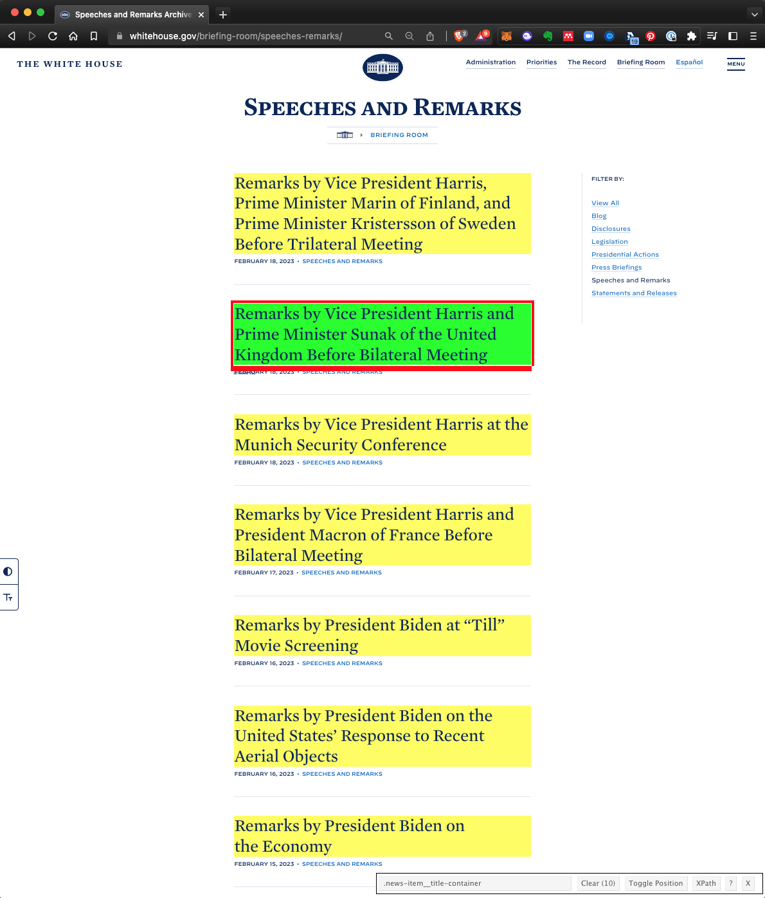

```{r child = "setup.Rmd"}
```

```{r packages, echo = FALSE, message=FALSE, warning=FALSE}
library(tidyverse)
library(rvest)
library(lubridate)
```

class: middle

# White House Speeches

---

## 🏁 Start with

```{r echo=FALSE, out.width="40%"}
knitr::include_graphics("img/wh-speeches.png")
```

---

## End with 🛑

```{r echo=FALSE}
wh_speeches <- read_rds("data/wh_speeches.rds") %>%
  print(n = 10)
```


---

## Define `scrape_speech()`

.pull-left-wide[
.small[
```{r}
scrape_speech <- function(url_to_scrape) {
  
  speech_page <- read_html(url_to_scrape)

  title <- speech_page %>%
    html_node(".news") %>%
    html_text2()
  
  date <- speech_page %>%
    html_node(".updated") %>%
    html_text() %>%
    mdy()
  
  location <- speech_page %>%
    html_node(".has-text-align-center") %>%
    html_text2()
  
  text <- speech_page %>%
    html_nodes("p") %>%
    html_text2() %>%
    list()
  
  tibble(
    title = title, date = date, location = location,
    text = text, url= url_to_scrape
  )
}
```
]
]

---

## Use `scrape_speech()`

```{r}
url_biden_UFO <- "https://www.whitehouse.gov/briefing-room/speeches-remarks/2023/02/16/remarks-by-president-biden-on-the-united-states-response-to-recent-aerial-objects/"
scrape_speech(url = url_biden_UFO)

url_jill_biden <- "https://www.whitehouse.gov/briefing-room/speeches-remarks/2023/02/13/remarks-as-prepared-for-delivery-by-first-lady-jill-biden-at-mesa-community-college/"
scrape_speech(url = url_jill_biden)
```

---

class: middle

# Inputs

---

## Inputs

.question[
You now have a function that will scrape the relevant info on speeches given the URL of the page of the speech. Where can we get a list of URLs of each of the speeches?
]

```{r echo=FALSE, out.width="32%"}

```


---

## All URLs

```{r output.lines=10}
all_speeches_page <- read_html("https://www.whitehouse.gov/briefing-room/speeches-remarks/")

wh_speech_urls <- all_speeches_page %>%
  html_nodes(".news-item__title") %>%
  html_attr("href")

wh_speech_urls
```

---

class: middle

# Iteration

---

## Define the task

- Goal: Scrape info on all White House speeches
- So far:
```{r eval=FALSE}
scrape_speech(wh_speech_urls[1])
scrape_speech(wh_speech_urls[2])
scrape_speech(wh_speech_urls[3])
```
- What else do we need to do?
  - Run the `scrape_speech()` function on all White House speech links
  - Combine the resulting data frames from each run into one giant data frame

---

## Iteration

.question[
How can we tell R to apply the `scrape_speech()` function to each link in `wh_speech_urls`?
]

--

- Option 1: Write a **for loop**, i.e. explicitly tell R to visit a link, apply the function, store the result, then visit the next link, apply the function, append the result to the stored result from the previous link, and so on and so forth.
--

- Option 2: **Map** the function to each element in the list of links, and let R take care of the storing and appending of results.
--

- We'll go with Option 2!

---

## How does mapping work?

Suppose we have exam 1 and exam 2 scores of 4 students stored in a list...

```{r}
exam_scores <- list(
  exam1 <- c(80, 90, 70, 50),
  exam2 <- c(85, 83, 45, 60)
)
```

--

...and we find the mean score in each exam

```{r}
map(exam_scores, mean)
```

---

...and suppose we want the results as a numeric (double) vector

```{r}
map_dbl(exam_scores, mean)
```

...or as a character string

```{r}
map_chr(exam_scores, mean)
```

---

## `map_something`

Functions for looping over an object and returning a value (of a specific type):

* `map()` - returns a list
* `map_lgl()` - returns a logical vector
* `map_int()` - returns a integer vector
* `map_dbl()` - returns a double vector
* `map_chr()` - returns a character vector
* `map_df()` / `map_dfr()` - returns a data frame by row binding
* `map_dfc()` - returns a data frame by column binding
* ...

---

## Go to each page, scrape speech

- Map the `scrape_speech()` function
- to each element of `wh_speech_urls`
- and return a data frame by row binding

```{r eval=FALSE}
wh_speeches <- map_dfr(wh_speech_urls, scrape_speech)
```

---

```{r include=FALSE}
wh_speeches <- read_rds("data/wh_speeches.rds")
```

```{r}
wh_speeches %>%
  print(n = 15)
```

---

## What could go wrong?

```{r eval=FALSE}
wh_speeches <- map_dfr(wh_speech_urls, scrape_speech)
```

- This will take a while to run
- If you get `HTTP Error 429 (Too many requests)` you might want to slow down your hits by modifying your function to slow it down by adding a random wait (sleep) time between hitting each link

```{r eval=FALSE}
scrape_speech <- function(url){
  
  # Sleep for randomly generated number of seconds
  # Generated from a uniform distribution between 0 and 1
  Sys.sleep(runif(1)) #<<
  
  # Rest of your function code goes here...
}
```
