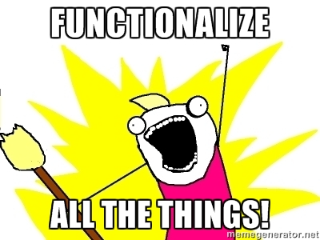

```{r child = "setup.Rmd"}
```

```{r packages, echo = FALSE, message=FALSE, warning=FALSE}
library(tidyverse)
library(rvest)
library(DT)
```

class: middle

# White House Speeches

---

## 🏁 Start with

```{r echo=FALSE, out.width="45%"}

```

---

## End with 🛑

```{r echo=FALSE}
# covid_speeches <- read_rds("data/covid-speeches-scot.rds") %>%
#   print(n = 15)
```


---

#### .center[
[https://www.whitehouse.gov/briefing-room/speeches-remarks](https://www.whitehouse.gov/briefing-room/speeches-remarks/)
]

```{r echo=FALSE, out.width="75%"}
knitr::include_graphics("img/wh-speeches-annotated.png")
```

---

```{r echo=FALSE, out.width="65%"}

```

---

## Plan

1. Scrape `title`, `date`, `location`, and `text` from a few of the individual pages of White House speeches to develop the code

2. Write a function that scrapes `title`, `date`, `location`, and `text` from each speech page

3. Scrape the `url`s of all White House speeches from the main page

4. Use this function to scrape from each individual speech from these `url`s and create a data frame with the columns `title`, `date`, `location`, `text`, and `url`

---

class: middle

# Scrape data from a few of the individual pages of White House speeches

---

## Read page for Biden's Feb 16 speech on UFOs

```{r eval=FALSE}
url <- "https://www.whitehouse.gov/briefing-room/speeches-remarks/2023/02/16/remarks-by-president-biden-on-the-united-states-response-to-recent-aerial-objects/"
speech_page <- read_html(url)
```

```{r include=FALSE}
url <- "https://www.whitehouse.gov/briefing-room/speeches-remarks/2023/02/16/remarks-by-president-biden-on-the-united-states-response-to-recent-aerial-objects/"
speech_page <- read_html("data/feb-16-biden-UFO.html")
```

.pull-left[
```{r}
speech_page
```
]
.pull-right[
```{r echo=FALSE, out.width="80%"}

```
]

---

## Extract title

.pull-left-wide[
<br><br>
```{r}
title <- speech_page %>%
    html_node(".news") %>%
    html_text2() 

title
```
]
.pull-right-narrow[
```{r echo=FALSE, out.width="100%"}

```
]

---

## Extract date

.pull-left-wide[
```{r}
library(lubridate)

speech_page %>%
    html_node(".updated") %>%
    html_text()

date <- speech_page %>%
    html_node(".updated") %>%
    html_text() %>%
    mdy()
date

```
]
.pull-right-narrow[
```{r echo=FALSE, out.width="100%"}
knitr::include_graphics("img/date.png")
```
]

---

## Extract location

.pull-left-wide[
```{r}
location <- speech_page %>%
    html_node(".has-text-align-center") %>%
    html_text2() 

location
  
```
]

.pull-right-narrow[
```{r echo=FALSE, out.width="100%"}

```
]

---

## Extract text

.pull-left-wide[
```{r output.lines=11}
text <- speech_page %>% 
    html_nodes("p") %>%
    html_text2() %>%
    list()

text
```
]
.pull-right-narrow[
```{r echo=FALSE, out.width="100%"}

```
]

---

## Put it all in a data frame

.pull-left[
```{r}
biden_speech <- tibble(
  title    = title,
  date     = date,
  location = location,
  text     = text,
  url      = url
)

glimpse(biden_speech)

```
]
.pull-right[
```{r echo=FALSE, out.width="70%"}

```
]

---

## Read page for Jill Biden's Feb 13th remarks at Mesa Community College

```{r eval=FALSE}
url <- "https://www.whitehouse.gov/briefing-room/speeches-remarks/2023/02/13/remarks-as-prepared-for-delivery-by-first-lady-jill-biden-at-mesa-community-college/"
speech_page <- read_html(url)
```

```{r include=FALSE}
url <- "https://www.whitehouse.gov/briefing-room/speeches-remarks/2023/02/13/remarks-as-prepared-for-delivery-by-first-lady-jill-biden-at-mesa-community-college/"
speech_page <- read_html("data/jill-biden-remarks.html")

```

```{r}
speech_page
```

---

## Extract components of Jill Biden's remarks

```{r}
title <- speech_page %>%
  html_node(".news") %>%
  html_text2()

date <- speech_page %>%
  html_node(".updated") %>%
  html_text() %>%
  mdy()

location <- speech_page %>%
  html_node(".has-text-align-center") %>%
  html_text2()

text <- speech_page %>%
  html_nodes("p") %>%
  html_text2() %>%
  list()
```

---

## Put it all in a data frame

.pull-left[
```{r}
jill_biden_remarks <- tibble(
  title    = title,
  date     = date,
  location = location,
  text     = text,
  url      = url
)

glimpse(jill_biden_remarks)
```
]
.pull-right[
```{r echo=FALSE, out.width="75%"}

```
]

---

class: middle

.larger[
.light-blue[
.hand[
this is getting tiring...
]
]
]

---

class: middle

# Functions

---

## When should you write a function?

--
.pull-left[
```{r echo=FALSE, out.width="100%"}

```
]
--
.pull-right[
When you’ve copied and pasted a block of code more than twice.
]

---

.question[
How many times will we need to copy and paste the code we developed to scrape data on all of the White House speeches?
]

```{r echo=FALSE, out.width="45%"}

```

---

## Why functions?

- Automate common tasks in a more powerful and general way than copy-and-pasting:
  - Give your function an evocative name that makes your code easier to understand
  - As requirements change, only need to update code in one place, instead of many
  - Eliminate chance of making incidental mistakes when you copy and paste (i.e. updating a variable name in one place, but not in another)

--

- Down the line: Improve your reach as a data scientist by writing functions (and packages!) that others use

---

.question[
Assuming that the page structure is the same for each speech page, how many "things" do you need to know for each speech page to scrape the data we want from it? 
]

.pull-left-wide[
.xsmall[
```{r eval=FALSE}
url_to_scrape <- "https://www.whitehouse.gov/briefing-room/speeches-remarks/2023/02/18/remarks-by-vice-president-harris-at-the-munich-security-conference-2/"

speech_page <- read_html(url_to_scrape)

title <- speech_page %>%
  html_node(".news") %>%
  html_text2()

date <- speech_page %>%
  html_node(".updated") %>%
  html_text() %>%
  mdy()

location <- speech_page %>%
  html_node(".has-text-align-center") %>%
  html_text2()

text <- speech_page %>%
  html_nodes("p") %>%
  html_text2() %>%
  list()

tibble(
  title = title, date = date, location = location,
  text = text, url= url
)
```
]
]

---

## Turn your code into a function

- Pick a short but informative **name**, preferably a verb.

<br>
<br>
<br>
<br>

```{r eval=FALSE}
scrape_speech <- 
  
  
  
  
  
  
```

---

## Turn your code into a function

- Pick a short but evocative **name**, preferably a verb.
- List inputs, or **arguments**, to the function inside `function`. If we had more the call would look like `function(x, y, z)`.

<br>

```{r eval=FALSE}
scrape_speech <- function(x){
  
  
  
  
  
}  
```

---

## Turn your code into a function

- Pick a short but informative **name**, preferably a verb.
- List inputs, or **arguments**, to the function inside `function`. If we had more the call would look like `function(x, y, z)`.
- Place the **code** you have developed in body of the function, a `{` block that immediately follows `function(...)`.

```{r eval=FALSE}
scrape_speech <- function(url_to_scrape){

  # code we developed earlier to scrape info 
  # on single speech goes here
  
}
```

---

## `scrape_speech()`

.pull-left-wide[
.small[
```{r}
scrape_speech <- function(url_to_scrape) {
  
  speech_page <- read_html(url_to_scrape)

  title <- speech_page %>%
    html_node(".news") %>%
    html_text2()
  
  date <- speech_page %>%
    html_node(".updated") %>%
    html_text() %>%
    mdy()
  
  location <- speech_page %>%
    html_node(".has-text-align-center") %>%
    html_text2()
  
  text <- speech_page %>%
    html_nodes("p") %>%
    html_text2() %>%
    list()
  
  tibble(
    title = title, date = date, location = location,
    text = text, url= url_to_scrape
  )
}
```
]
]

---

## Function in action

```{r}
scrape_speech(url = "https://www.whitehouse.gov/briefing-room/speeches-remarks/2023/02/16/remarks-by-president-biden-on-the-united-states-response-to-recent-aerial-objects/") %>%
  glimpse()
```

---

## Function in action

```{r}
scrape_speech(url = "https://www.whitehouse.gov/briefing-room/speeches-remarks/2023/02/13/remarks-as-prepared-for-delivery-by-first-lady-jill-biden-at-mesa-community-college/") %>%
  glimpse()
```

---

## Function in action

```{r}
scrape_speech(url = "https://www.whitehouse.gov/briefing-room/speeches-remarks/2023/02/18/remarks-by-vice-president-harris-at-the-munich-security-conference-2/") %>%
  glimpse()
```

---

class: middle

# Writing functions

---

## What goes in / what comes out?

.pull-left-wide[
- They take input(s) defined in the function definition

```{r eval=FALSE}
function([inputs separated by commas]){
  # what to do with those inputs
}
```

- By default they return the last value computed in the function

```{r eval=FALSE}
scrape_page <- function(x){
  # do bunch of stuff with the input...
  
  # return a tibble
  tibble(...)
}
```

- You can define more outputs to be returned in a list as well as nice print methods (but we won't go there for now...)
]

---

.question[
What is going on here?
]

```{r}
add_2 <- function(x){
  x + 2
  1000
}
```

```{r}
add_2(3)
add_2(10)
```

---

## Naming functions

> "There are only two hard things in Computer Science: cache invalidation and naming things." - Phil Karlton

---

## Naming functions

- Names should be short but clearly evoke what the function does

--
- Names should be verbs, not nouns

--
- Multi-word names should be separated by underscores (`snake_case` as opposed to `camelCase`)

--
- A family of functions should be named similarly (`scrape_page()`, `scrape_speech()` OR `str_remove()`, `str_replace()` etc.)

--
- Avoid overwriting existing (especially widely used) functions

```{r eval=FALSE}
# JUST DON'T
mean <- function(x){ 
  x * 3 
  }
```
