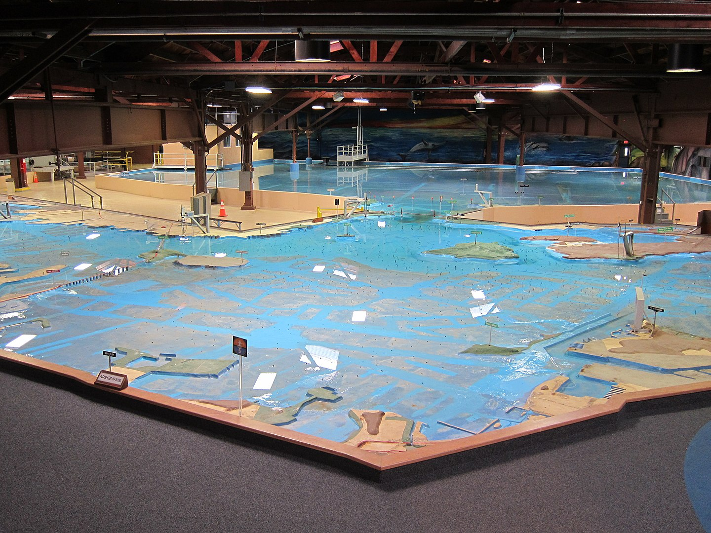
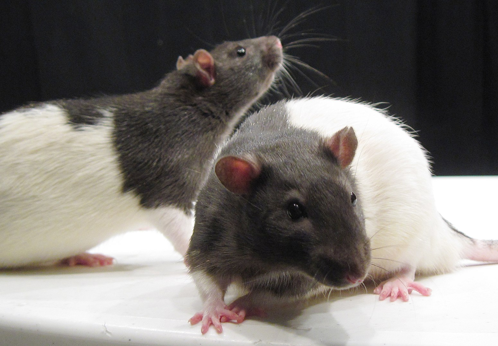
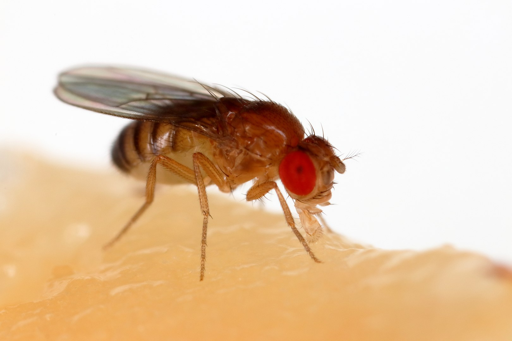
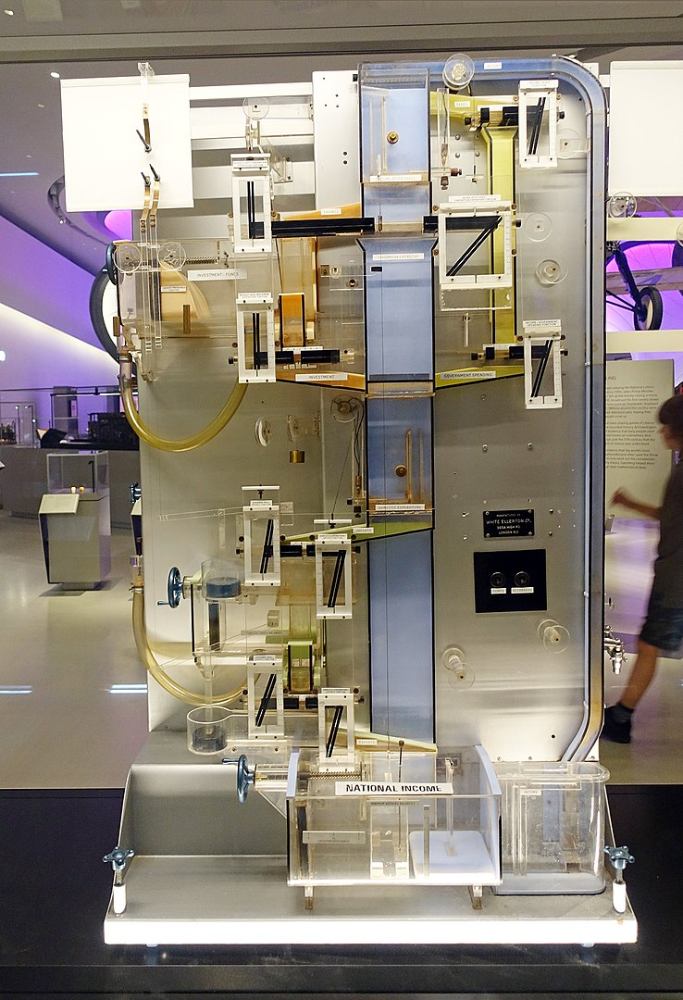

```{r child = "setup.Rmd"}
```

```{r packages, echo=FALSE, message=FALSE, warning=FALSE}
# library(tidyverse)
```


## What is a model?

.hand[
Models are a way to create a simplified or controllable version of some scientific topic of interest
]
---

## Physical models

Engineers construct physical models to test the properties of their designs and to predict how complex systems will operate.

  

---

## Model animals

Biologists use model animals to examine biological systems and to conduct experiments that cannot be ethically conducted on humans.

  

---

## MONIAC

.pull-left[

The MONIAC was a model of macroeconomic factors that used hydraulics moving water between tanks with pumps and drains to represent the flow of money to different areas of the economy.
]

.pull-right[
```{r echo=F, out.width="70%"}
# 


```
]

---

## Statistical Models

.hand[
Provide an abstract, mathematical description of the topic or process of scientific interest
]

--
In the context of data science ...

- __Data__ are the objects of interest
- Work construct model of the process or processes that generated that data

--

We create models of the __data generating process__.

---

## Schema of statistical models

The general format is:

$$\text{data} = \text{model} + \text{noise}$$

--

Or more generally:

$$\text{data} = f(\text{model, noise})$$

The data are a _function_ of the model and noise.

---

## The purpose of models

As (data) scientists, we use models for ...

- __Prediction__
	- Predict a value
	- Forecast the future
	- Classify into categories
- __Inference__
	- Describe relationships
		- e.g. between lead exposure and personality
		- e.g. between sleep deprivation and response times in a cognitive task
	- Test interventions to determine causal relationships

---

## Modeling workflow

__Initial steps__
- Process data
- Visualize potential relationships between variables

__Modeling__
- Propose a model (or set of models)
- Evaluate the model and conduct checks
	- Predictive checks
	- Examine residuals (prediction errors)
- Compare the models and select the best
	- Start simple, examine whether you need to add complexity
	- Or start complex and compare with "reduced" models

--

.hand[And repeat these modeling steps as needed!]
---
