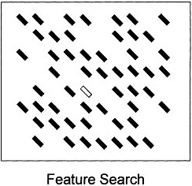
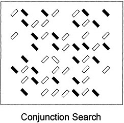
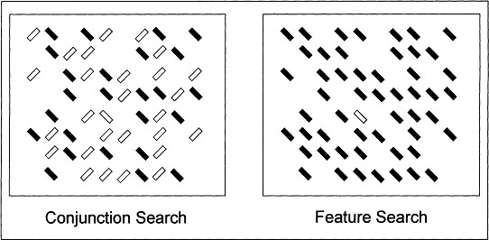

<style>

.xsmall-scrunched {
  line-height: .65;
  font-size: 65%;
}

</style>


```{r child = "setup.Rmd"}
```

```{r packages, echo=FALSE, message=FALSE, warning=FALSE}
library(tidyverse)
# library(xaringanthemer)
knitr::opts_chunk$set(dev.args = list(bg = 'transparent'), echo=F)
ggplot2::theme_set(ggplot2::theme_bw(base_size = 20))
```


class: middle

## Case study: Visual search

---

## Visual Search

```{r}
knitr::include_graphics("img/wheres-waldo.jpg")
```

---

## Feature search

--

```{r feat-conj-ex1, fig.align='center'}

```

---

## Conjunction search

--

```{r feat-conj-ex2, fig.align='center'}

```

---

## Feature and Conjunction search

```{r feat-conj-ex3, fig.align='center'}

```

---

## Feature Integration Theory

```{r feat-int-theory, fig.align='center', out.height="80%"}
knitr::include_graphics("img/feature-integration-diag.png")
```
.small[Triesman & Gelade, 1980]
---

## Visual search data

- 18 participants randomly assigned to feature or conjunction search conditions (between subjects)
- Completed with 3, 6, 12, and 18 total items in the display
- Response times measured and averaged from approximately 400 trials for each condition
- First focusing on trials where target was present in the display
- Data collected by Jeremy Wolfe

```{r, message=F}
vizsearch <- read_csv("../data/visual-search.csv") %>% 
  mutate(
    cond_conj = if_else(condition=="feature", 0, 1),
    targ_absent = if_else(message=="HIT",0,1)
    ) %>% 
  select(subject, cond_conj, targ_absent, setsize, rt)
```

```{r, echo=T, message=F}
vs <- vizsearch %>% 
  filter(targ_absent==1)
```

---

## Visual search data

```{r, echo=T}
vs
```

---

## Plotting the visual search data

```{r, fig.align='center'}
vs %>%
  mutate(cond_conj = factor(cond_conj, labels = c("feat", "conj"))) %>%
  ggplot(aes(x = setsize, y = rt, color = cond_conj)) +
  geom_jitter(width = .5, height = 0) +
  scale_x_continuous(breaks = c(3, 6, 12, 18))
```

.midi[
.question[ How would you summarize the relationships shown in this plot? ]
]
--

.midi[
It looks like the relationship between set size and response time depends on the condition: response times are consistent across set size for feature search but increase with set size for conjunction search.
]
---

## Interactions

> It looks like the relationship between set size and response time __depends on__ the condition: response times are consistent across set size for feature search but increase with set size for conjunction search.

__Interaction__: When the relationship between two variables "depends on" the level of another variable. 

--

- To include an interaction in our regression, we can create a new variable that is the product of the two variables interacting:

$$\text{interaction} = \text{variable_1} * \text{variable_2} $$
---

## Creating interaction variables manually

```{r, echo=T}
d <- vs %>% 
  mutate(setsize_cond = setsize * cond_conj)
```

.pull-left-narrow[
```{r, echo=F}
d %>% 
  distinct(cond_conj, setsize, setsize_cond)
```
]
.pull-right-wide[

```{r, echo=F}
d %>% 
  mutate(cond_conj = factor(cond_conj, labels = c("feat", "conj"))) %>%
  ggplot(aes(x = setsize, y = setsize_cond, color = cond_conj)) +
  geom_point()
```
]

The interaction coefficient is going to in some way represent the effect or slope of setsize __in the conjunction condition__. More specifically, it will represent the __difference__ between the effect of setsize in the conjunction condition and the effect of set size overall.
---

## Fitting the interaction model

```{r, echo=T}
(fit_int <- lm(rt ~ setsize + cond_conj + setsize_cond, data = d))
```
--

- `Intercept`: Predicted RT in the feature condition when setsize = 0
- `setsize`: Increase in RT with each additional item in the feature condition (slope in ms/item)
- `cond_conj`: Difference between average RT in the feature and conjunction conditions when setsize=0
- `setsize_cond`: Additional increase in RT for each additional item in the conjunction condition; i.e. the difference between the slopes in ms/item in the feature condition vs. the conjunction condition.

---

## Letting `lm()` compute interaction terms

- `lm()` will automatically compute interaction terms between variables
- Replace the `+` operator with the `*` operator to include both predictors and their interaction in the model
- Or specify the interaction term explicitly with a `:` between variables (e.g. `var1:var2`)

```{r, echo=T}
(fit_int <- lm(rt ~ setsize * cond_conj, data = vs))
```

---

## Model checks: Residual Histogram

.question[Check: Do the residuals appear normally distributed?]

```{r}
tibble(residual = fit_int$residuals) %>% 
  ggplot(aes(x=residual)) +
  geom_histogram()
```

---

## Model checks: Quantile-quantile plot

.question[Check: Are all the points following the line?]

```{r}
tibble(residual = fit_int$residuals) %>% 
  ggplot(aes(sample = residual)) + # NOTE: stat_qq* expect a sample aesthetic
  stat_qq() +
  stat_qq_line() +
  labs(x="Theoretical quantile", y = "Observed quantile")
```

---

## Model checks: predicted x residual plot

.question[
Check: Are there any relationships between predicted values and the residuals? Ideally, the scatterplot should look like a "cloud of points"
]

```{r}
tibble(
  predicted = fit_int$fitted.values,
  residual = fit_int$residuals
) %>% 
  ggplot(aes(x = predicted, y = residual)) +
  geom_point() +
  geom_hline(yintercept = 0)
```

---

## Heteroskedasticity

.tip[
These data show evidence of __heteroskedasticity__, the magnitude of the residuals varies with the predicted values.
]

```{r}
tibble(
  predicted = fit_int$fitted.values,
  residual = fit_int$residuals
) %>% 
  ggplot(aes(x = predicted, y = residual)) +
  geom_point() +
  geom_hline(yintercept = 0)
```

---

## Evaluating model predictions


```{r, echo=T}
preds <- vs %>% 
  distinct(setsize, cond_conj) %>% 
  mutate(predicted = predict(fit_int, .))
```

```{r}
vs %>% 
  ggplot(aes(x = setsize, y = rt, color = factor(cond_conj))) + 
  geom_point() +
  geom_line(data = preds, aes(x=setsize, y = predicted, group=cond_conj))
  
```

---

## Evaluating model fit

```{r}
summary(fit_int)
```

__Our model accounts for `r round(summary(fit_int)$r.squared*100)`% of the variance in the response times.__

---


## Model comparison: reduced models

We might be pretty happy with our model, but before we decide how we really feel about it, we need to compare it to alternative models.
- One approach is to compare our primary model to __reduced model(s)__ that remove various components

```{r, echo=T}
fit_r1 <- lm(rt ~ cond_conj + setsize, data = vs)
fit_r2 <- lm(rt ~ cond_conj, data = vs)
fit_r3 <- lm(rt ~ setsize, data = vs)

```

---

## Model comparison: $R^2$?

.question[
Should we use $R^2$ to compare models?
]

--

- $R^2$ is nice because it gives us an absolute measure of model fit
- But it's not so nice for comparing models against one another
  - This is because $R^2$ will always increase as we add predictors to the model, even if those predictors are no good!
- $R^2$ does not account for __model complexity__

---

## Generalization: No surprises

- As scientists, we don't just want to describe what is happening in our sample of observations, but also to generalize to new unseen data.
- A good model means we should not be surprised by new observations.

--

- __Information theory__ gives us a measure of _surprising-ness_ or __Entropy__

<!-- $$H(p) = -E[log(p_i)]$$ -->
What we'd like to know is: How surprised should we expect to be by a new random data point?
---

## Akaike Information Criteria

- The __Akaike Information Criteria__ (__AIC__) is an estimate of the expected "surprising-ness" of new data, given a model
- This offers a good way to compare and select models

---

## Model comparison with AIC

AIC is a __relative__ measure of model fit
- Individual AIC values are not really meaningful, only the differences between AIC for different models should be interpreted
  - AIC can be basically any number, and can be either positive or negative
  - Lower values of AIC are better: AIC measures how surprised we expect to be given new data, and we don't like surprises, so lower is always better

__AIC rules of thumb__

- Differences of
  - 2 or less: models are indistinguishable from one another
  - 2-5: Indicate some evidence for the better-fitting model
  - 5-10: Indicate good evidence for better-fitting model
  - 10 or more: Indicate very strong evidence for the better-fitting model

---

## Comparing original and reduced models with AIC

We can compute AIC with the `AIC()` function, passing in each of our models as arguments.

```{r, echo=T}
AIC(fit_int, fit_r1, fit_r2, fit_r3)
```

- Here we see that our original model does the best, with the lowest AIC score.
  - $\Delta \text{AIC} = -21.7$ 

---

## Model check: Reduced model `fit_r1`

.tip[
You can see the misspecification of this model in the residuals plot. It looks like there are relationships not accounted for by the model that produce a pattern in the relationship between the model's residuals and predictions.
]

```{r}
tibble(
  predicted = fit_r1$fitted.values,
  residual = fit_r1$residuals
) %>% 
  ggplot(aes(x = predicted, y = residual)) +
  geom_point() +
  geom_hline(yintercept = 0) +
  geom_smooth()
```

---

## Extrapolation

- Let's use our model to predict response times for new, unseen conditions. 
- We'll predict response times for feature and conjunction searches with setsizes of 10 and 20. 
- __Extrapolation__: Predicting values beyond the range of data. Must be careful!

---

## Predicting manually

- __A__: feature search with setize = 10
- __B__: conjunction search with setsize = 20

$$\hat{y} = 423.85 + -.57*s + 71.89 * c + 26.43 * \text{c:s}$$
--

$$\hat{y}_A = 423.85 + -.57*10 + 71.89 * 0 + 26.43 * 0 = 418.2$$
$$\hat{y}_B = 423.85 + -.57*20 + 71.89 * 1 + 26.43 * 20 = 1013.13$$

---

## `predict()`ing

```{r, echo=T}
tribble(
  ~cond_conj, ~setsize,
  0, 10,
  1, 20
) %>% 
  mutate(
    predicted = predict(fit_int, .)
  )
```

---