Robot Intelligence
================
Nicholas Duran

    ## [1] "/Users/nickduran/Desktop/GitProjects/CBI-courses/bdsR1/live-coding"

``` r
df1 = read.csv("../nicksandbox/robot-intelligence.csv", header = TRUE) %>% 
  filter(opinion != "None of these" & opinion != "Don't know")
head(df1)
```

    ##   education
    ## 1     NO HS
    ## 2     NO HS
    ## 3     NO HS
    ## 4     NO HS
    ## 5     NO HS
    ## 6     NO HS
    ##                                                                        opinion
    ## 1 Most robots have already developed higher levels of intelligence than humans
    ## 2 Most robots have already developed higher levels of intelligence than humans
    ## 3 Most robots have already developed higher levels of intelligence than humans
    ## 4 Most robots have already developed higher levels of intelligence than humans
    ## 5 Most robots have already developed higher levels of intelligence than humans
    ## 6 Most robots have already developed higher levels of intelligence than humans

# Order Matters

## Alphabetical order is rarely ideal

``` r
ggplot(df1, aes(x = education)) +
  geom_bar()
```

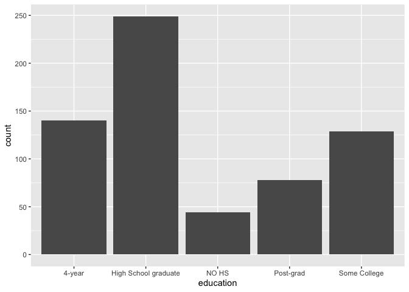<!-- -->

## Order by frequency

``` r
ggplot(df1, aes(x = fct_infreq(education))) +
  geom_bar()
```

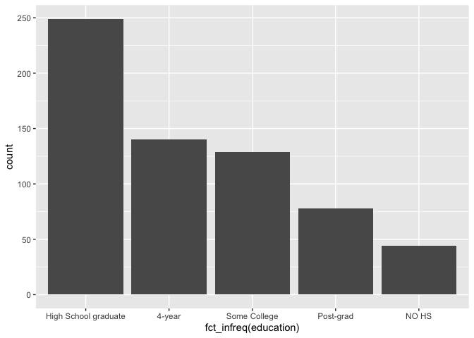<!-- -->

## Use Inherent Level Order

``` r
df1 <- df1 %>%
  mutate(
    education = fct_relevel(
      education,
      "NO HS", "High School graduate", "Some College", "4-year", "Post-grad"
    )
  )

ggplot(df1, aes(x = education)) +
  geom_bar()
```

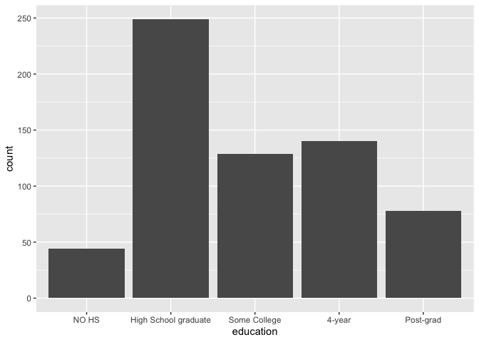<!-- -->

## Clean-up Labels

``` r
ggplot(df1, aes(x = education)) +
  geom_bar() +
  labs(
    x = "Education",
    y = "Count"
  )
```

<!-- -->

## Clean up labels

``` r
df1 <- df1 %>%
  mutate(
    education = fct_recode(
      education,
      "High School" = "High School graduate",
      "BA / BS" = "4-year",
      "Some College" = "Some College",
      "Graduate" = "Post-grad",
      "No High School" = "NO HS"
    )
  )

## can drop the clean-up labels bit here and read at the end 
ggplot(df1, aes(x = education)) +
  geom_bar() +
  labs(
    x = "Education",
    y = "Count"
  )
```

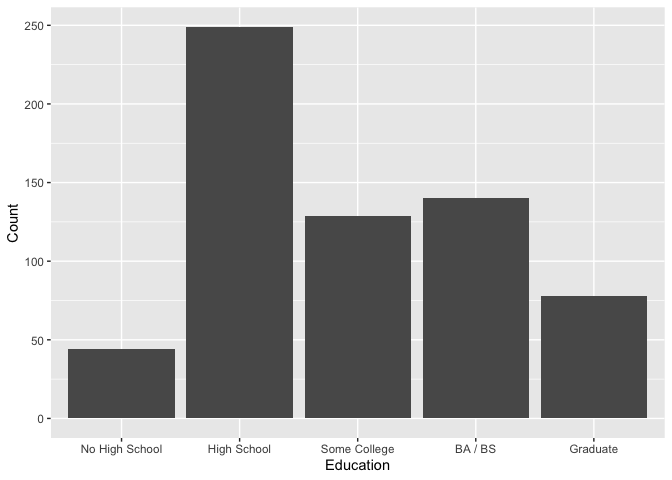<!-- -->

## Long categories can be hard to read

``` r
ggplot(df1, aes(y = education)) +
  geom_bar() +
  labs(
    x = "Count",
    y = "Education"
  )
```

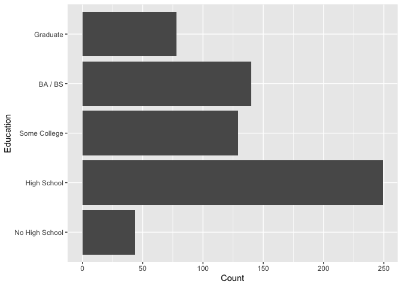<!-- -->

## And reverse the order of levels

``` r
ggplot(df1, aes(y = fct_rev(education))) +
  geom_bar() +
  labs(
    x = "Count",
    y = "Education"
  )
```

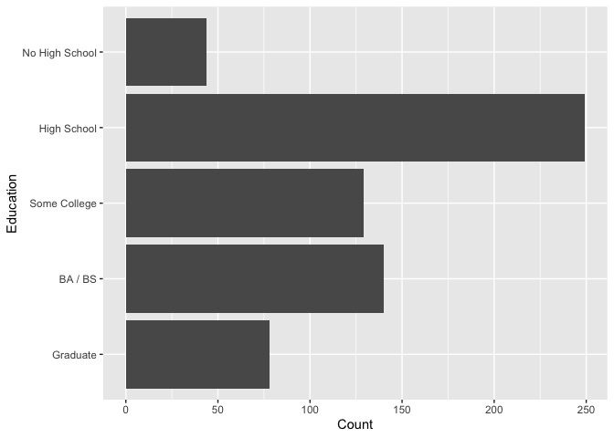<!-- -->

<!-- / -->

## PREPARE THE OPINION DATA

### Severe long labels; need serious clean up

``` r
ggplot(df1, aes(x = opinion)) +
  geom_bar()
```

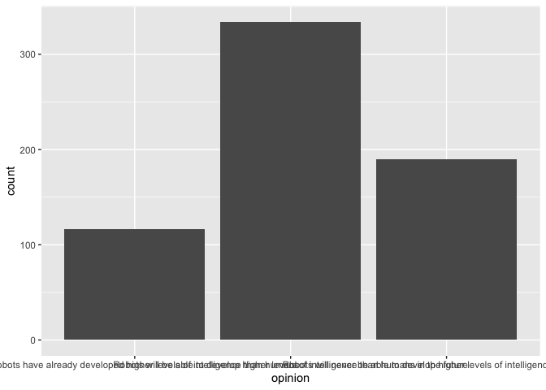<!-- -->

``` r
df1 <- df1 %>%
  mutate(
    opinion = fct_recode(
      opinion,
      "Already Surpassed" = "Most robots have already developed higher levels of intelligence than humans",
      "Surpass in Future" = "Robots will be able to develop higher levels of intelligence than humans in the future",
      "Never Surpass" = "Robots will never be able to develop higher levels of intelligence than humans"
    )
  )

ggplot(df1, aes(x = opinion)) +
  geom_bar()
```

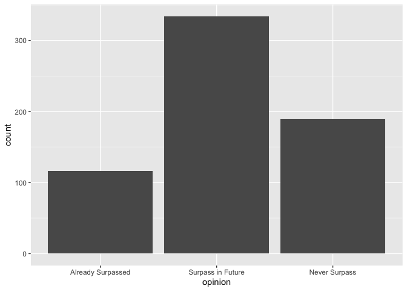<!-- -->

## Segmented bar plots can be hard to read

``` r
ggplot(df1, aes(y = education, fill = opinion)) +
  geom_bar()
```

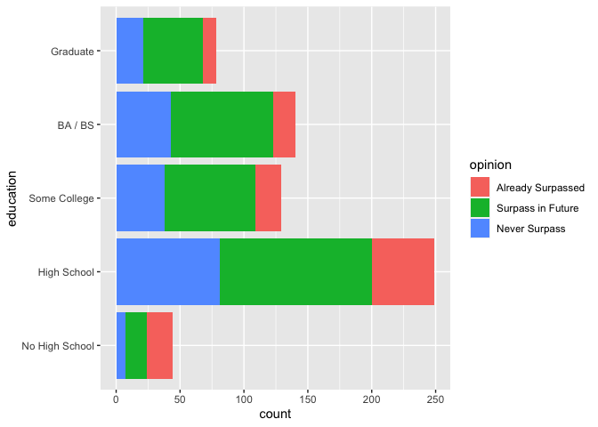<!-- -->
\## Use facets

``` r
ggplot(df1, aes(y = opinion, fill = education)) +
  geom_bar() +
  facet_wrap(~education, nrow = 1)
```

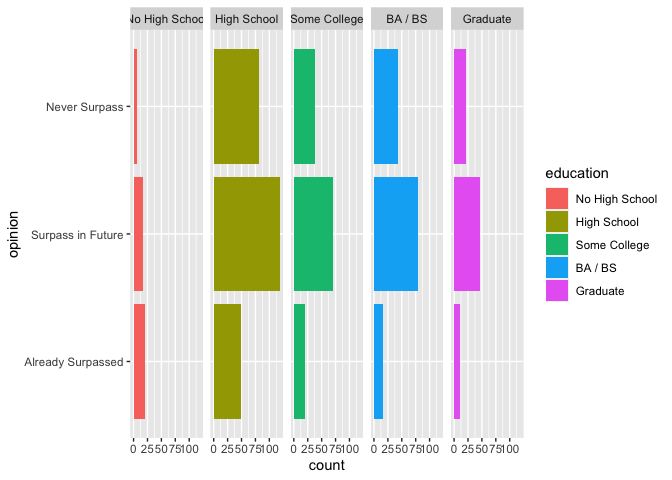<!-- -->

## Avoid redundancy?

``` r
ggplot(df1, aes(y = opinion)) +
  geom_bar() +
  facet_wrap(~education, nrow = 1)
```

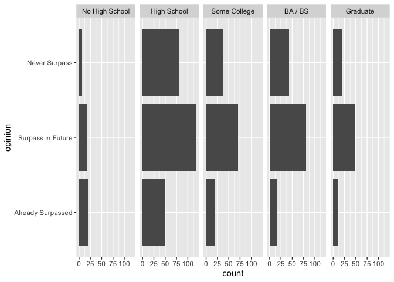<!-- -->

## Redundancy can help tell a story

``` r
ggplot(df1, aes(y = opinion, fill = education)) +
  geom_bar() +
  facet_wrap(~education, nrow = 1)
```

<!-- -->

## Be selective with redundancy

``` r
ggplot(df1, aes(y = opinion, fill = opinion)) +
  geom_bar() +
  facet_wrap(~education, nrow = 1) +
  guides(fill = FALSE)
```

    ## Warning: The `<scale>` argument of `guides()` cannot be `FALSE`. Use "none" instead as
    ## of ggplot2 3.3.4.

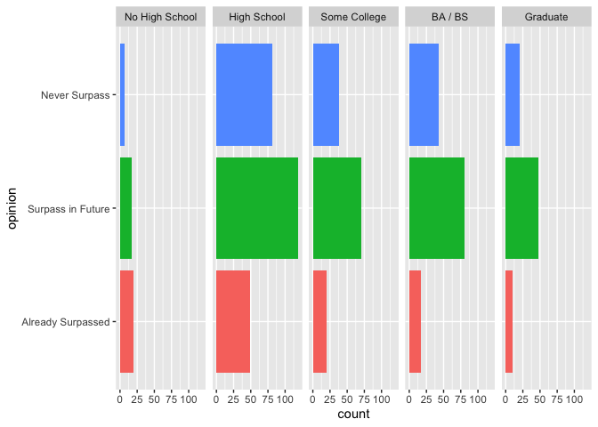<!-- -->

## Use informative labels

``` r
ggplot(df1, aes(y = opinion, fill = opinion)) +
  geom_bar() +
  facet_wrap(~education, nrow = 1) +
  guides(fill = FALSE) +
  labs(
    title = "Robot intelligence: Have they surpassed humans?",
    x = NULL, y = NULL
  )
```

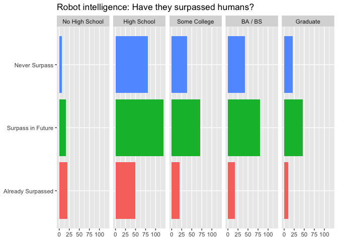<!-- -->

## A bit more info

``` r
ggplot(df1, aes(y = opinion, fill = opinion)) +
  geom_bar() +
  facet_wrap(~education, nrow = 1) +
  guides(fill = FALSE) +
  labs(
    title = "Robot intelligence: Have they surpassed humans?",
    subtitle = "YouGov Survey Results, 05 January 2023",
    caption = "Source: https://today.yougov.com/topics/politics/trackers/robot-intelligence",
    x = NULL, y = NULL
  )
```

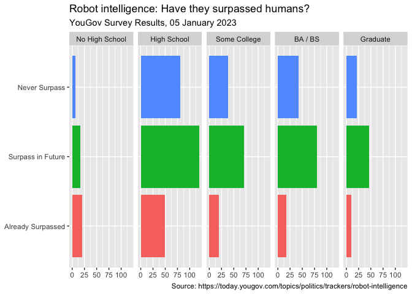<!-- -->

## Let’s do better

``` r
ggplot(df1, aes(y = opinion, fill = opinion)) +
  geom_bar() +
  facet_wrap(~education, nrow = 1) +
  guides(fill = FALSE) +
  labs(
    title = "Robot intelligence: Have they surpassed humans?",
    subtitle = "YouGov Survey Results, 05 January 2023",
    caption = "Source: http://bit.ly/3JubdGu",
    x = NULL, y = NULL
  )
```

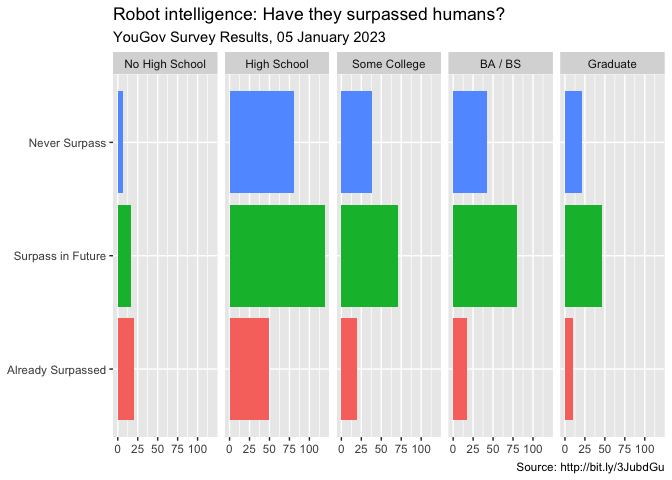<!-- -->

## Fix up facet labels

``` r
ggplot(df1, aes(y = opinion, fill = opinion)) +
  geom_bar() +
  facet_wrap(~education, 
             nrow = 1,
            labeller = label_wrap_gen(width = 12)
  ) +
  guides(fill = FALSE) +
  labs(
    title = "Robot intelligence: Have they surpassed humans?",
    subtitle = "YouGov Survey Results, 05 January 2023",
    caption = "Source: http://bit.ly/3JubdGu",
    x = NULL, y = NULL
  )
```

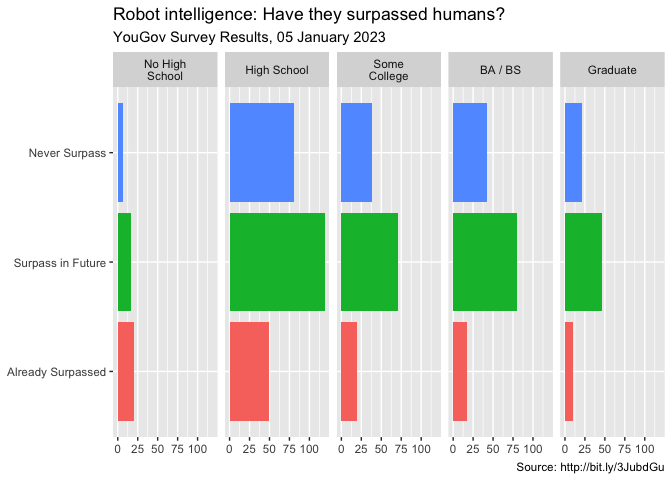<!-- -->

# Select meaningful colors

## Rainbow colors not always the right choice

## Manually choose colors when needed

``` r
ggplot(df1, aes(y = opinion, fill = opinion)) +
  geom_bar() +
  facet_wrap(~education, nrow = 1, labeller = label_wrap_gen(width = 12)) +
  guides(fill = FALSE) +
  labs(title = "Robot intelligence: Have they surpassed humans?",
    subtitle = "YouGov Survey Results, 05 January 2023",
    caption = "Source: http://bit.ly/3JubdGu",
       x = NULL, y = NULL) +
  scale_fill_manual(values = c(
    "Never Surpass" = "red",
    "Already Surpassed" = "green",
    "Surpass in Future" = "gray"
  ))
```

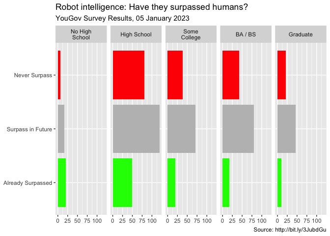<!-- -->

## Use better colors

``` r
ggplot(df1, aes(y = opinion, fill = opinion)) +
  geom_bar() +
  facet_wrap(~education, nrow = 1, labeller = label_wrap_gen(width = 12)) +
  guides(fill = FALSE) +
  labs(title = "Robot intelligence: Have they surpassed humans?",
    subtitle = "YouGov Survey Results, 05 January 2023",
    caption = "Source: http://bit.ly/3JubdGu",
       x = NULL, y = NULL) +
  scale_fill_manual(values = c(
    "Never Surpass" = "#ef8a62",
    "Already Surpassed" = "#67a9cf",
    "Surpass in Future" = "gray"    
  ))
```

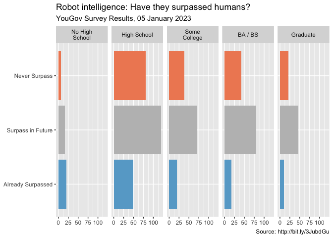<!-- -->

## Select theme

``` r
ggplot(df1, aes(y = opinion, fill = opinion)) +
  geom_bar() +
  facet_wrap(~education, nrow = 1, labeller = label_wrap_gen(width = 12)) +
  guides(fill = FALSE) +
  labs(title = "Robot intelligence: Have they surpassed humans?",
    subtitle = "YouGov Survey Results, 05 January 2023",
    caption = "Source: http://bit.ly/3JubdGu",
       x = NULL, y = NULL) +
  scale_fill_manual(values = c(
    "Never Surpass" = "#ef8a62",
    "Already Surpassed" = "#67a9cf",
    "Surpass in Future" = "gray")) +
    theme_minimal()
```

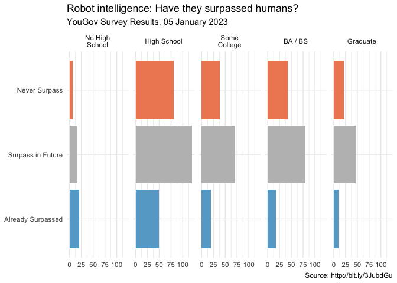<!-- -->
