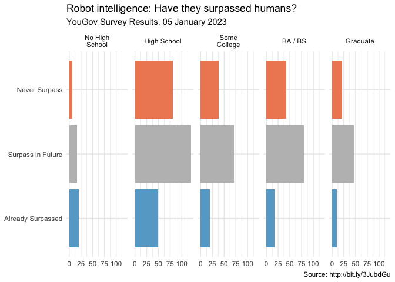

Robot Intelligence
================
Nicholas Duran

<!-- Change the visualization in three different ways to tell slightly different stories with it each time. -->

In January 2023, YouGovAmerica survey asked 915 US adults the following
question:

> Which ONE, if any, of the following statements do you MOST agree with?
>
> - Most robots have already developed higher levels of intelligence
>   than humans
> - Robots will be able to develop higher levels of intelligence than
>   humans in the future
> - Robots will never be able to develop higher levels of intelligence
>   than humans

The data from the survey is in `data-raw/robots.csv`.

``` r
robots <- read_csv("mod-05-data-raw/robot-intelligence.csv")
```

In the course video we made the following visualization.

``` r
robots <- robots %>%
  mutate(
    education = fct_recode(education, "High School" = "High School graduate", "BA / BS" = "4-year", "Some College" = "Some College", "Graduate" = "Post-grad", "No High School" = "NO HS"),
    education = fct_relevel(education, "No High School", "High School", "Some College", "BA / BS", "Graduate"),
    opinion = fct_recode(opinion,
      "Already Surpassed" = "Most robots have already developed higher levels of intelligence than humans",
      "Surpass in Future" = "Robots will be able to develop higher levels of intelligence than humans in the future",
      "Never Surpass" = "Robots will never be able to develop higher levels of intelligence than humans")
  ) %>% 
  filter(!opinion %in% c("None of these", "Don't know"))

ggplot(robots, aes(y = opinion, fill = opinion)) +
  geom_bar() +
  facet_wrap(~education,
    nrow = 1, labeller = label_wrap_gen(width = 12)
  ) +
  guides(fill = "none") +
  labs(
    title = "Robot intelligence: Have they surpassed humans?",
    subtitle = "YouGov Survey Results, 05 January 2023",
    caption = "Source: http://bit.ly/3JubdGu",
    x = NULL, y = NULL
  ) +
  scale_fill_manual(values = c(
    "Never Surpass" = "#ef8a62",
    "Already Surpassed" = "#67a9cf",
    "Surpass in Future" = "gray"
  )) +
  theme_minimal()
```

<!-- -->

In this application exercise we tell different stories with the same
data.

### Exercise 1 - Free scales

Add `scales = "free_x"` as an argument to the `facet_wrap()` function.
How does the visualisation change? How is the story this visualisation
telling different than the story the original plot tells?

``` r
ggplot(robots, aes(y = opinion, fill = opinion)) +
  geom_bar() +
  facet_wrap(~education,
    nrow = 1, labeller = label_wrap_gen(width = 12),
    # ___
  ) +
  guides(fill = "none") +
  labs(
    title = "Robot intelligence: Have they surpassed humans?",
    subtitle = "YouGov Survey Results, 05 January 2023",
    caption = "Source: http://bit.ly/3JubdGu",
    x = NULL, y = NULL
  ) +
  scale_fill_manual(values = c(
    "Never Surpass" = "#ef8a62",
    "Already Surpassed" = "#67a9cf",
    "Surpass in Future" = "gray"
  )) +
  theme_minimal()
```

<!-- -->

### Exercise 2 - Comparing proportions across facets

First, calculate the proportion of “never surpass”, “already surpass”,
and “surpass in future” answers in each category and then plot these
proportions (rather than the counts) and then improve axis labeling. How
is the story this visualization telling different than the story the
original plot tells? **Hint:** You’ll need the **scales** package to
improve axis labeling, which means you’ll need to load it on top of the
document as well.

``` r
# code goes here
```

### Exercise 3 - Comparing proportions across bars

Recreate the same visualization from the previous exercise, this time
dodging the bars for opinion proportions for each education level,
rather than faceting by education level and then improve the legend. How
is the story this visualization telling different than the story the
previous plot tells?

``` r
# code goes here
```
