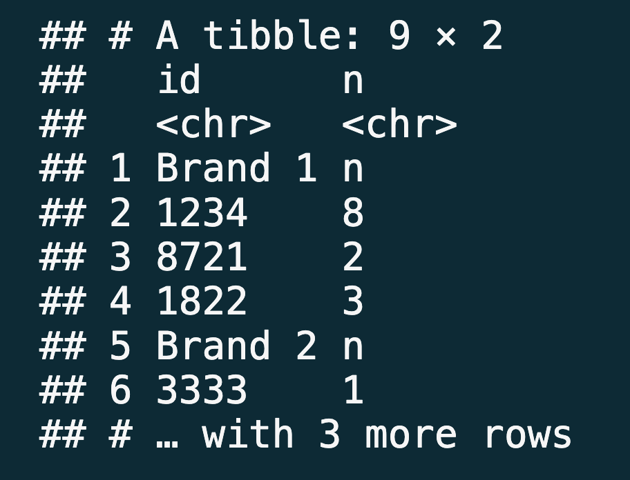
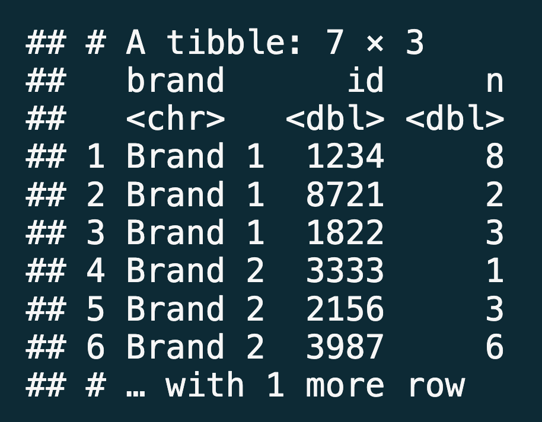

Sales
================
Nicholas Duran

``` r
library(tidyverse)
library(readxl)
```

- Read in the Excel file called `sales.xlsx` from the `data-raw/` folder
  such that it looks like the following.



- **Stretch goal:** Manipulate the sales data such such that it looks
  like the following.


